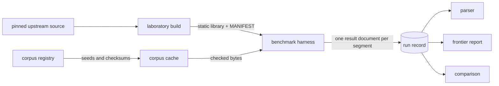

# Benchmarks

This page states the measurement laboratory as it exists now.

No Entroq number appears on this page, and none exists anywhere. The harness links no Entroq
codec, so every Entroq cell below is N/A with the reason.

The competitor numbers below come from a sealed gate-tier record. The gate tier is not the
publication tier. Read every number with the scope stated beside it, and read the timing
stability section before reading any throughput as a property of a codec rather than of this
machine.

## The measurement pipeline



The laboratory and the corpus cache live outside the repository. The registry that describes
the corpus and the pin that names each competitor commit are in the repository; the bytes
they describe are not.

The harness links the laboratory at build time and measures a competitor in-process, through
the library that project publishes. It does not run a competitor's command line tool: a
process invocation costs milliseconds, the codec work at every size class up to the large one
costs less, and two of the five competitors publish no tool at all.

## Competitors

Each competitor is built from the commit behind its release tag, as a static library, with
the release configuration its own project recommends.

| Codec | Version | Upstream commit |
|---|---|---|
| LZ4 | v1.10.0 | `ebb370ca83af193212df4dcbadcc5d87bc0de2f0` |
| Zstandard | v1.5.7 | `f8745da6ff1ad1e7bab384bd1f9d742439278e99` |
| Brotli | v1.2.0 | `028fb5a23661f123017c060daa546b55cf4bde29` |
| Snappy | 1.2.2 | `6af9287fbdb913f0794d0148c6aa43b58e63c8e3` |
| zlib | v1.3.2 | `da607da739fa6047df13e66a2af6b8bec7c2a498` |

A build carries a manifest stating how it was produced, including the build command, the
compiler version, the architecture, and the checksum of every library the linker is given. A
build with no manifest cannot appear in a result. A pinned build is never rebuilt in place: a
new build of the same project takes a new version directory, so an old result keeps pointing
at the build that produced it.

A rebuild from a manifest reproduces behavior, not bytes. Every rebuilt archive has exactly
the size of the one it was compared against and differs from it in a few tens of bytes out of
tens or hundreds of kilobytes. Each build records that measurement: the size, the differing
byte count, and the first differing offsets. The manifest checksum identifies the artifact a
result was produced with. It is not a claim that the build is bit reproducible.

## Operating points

A competitor is measured across the points its project exposes, not at one default level.

| Codec | Points | Groups |
|---|---|---|
| LZ4 | `fast-1`, `fast-3`, `fast-5`, `fast-9`, `hc-1`, `hc-4`, `hc-9`, `hc-12` | `fast`, `hc` |
| Zstandard | `level-1`, `level-3`, `level-6`, `level-9`, `level-12`, `level-15`, `level-19`, `level-22` | `low`, `high`, `max` |
| Brotli | `q0`, `q2`, `q5`, `q9`, `q11` | `low`, `high`, `max` |
| Snappy | `default` | `default` |
| zlib | `level-1`, `level-6`, `level-9` | `low`, `high` |

The cost of one point spans three orders of magnitude inside one project, so the points of a
competitor are grouped by cost. A segmented campaign measures one group and one size class per
segment, which is what keeps each segment inside its budget.

## Corpus

The registry states the source, the checksum, the size, the class, and the license of every
entry. A project entry is generated from a recorded seed through a sequence this repository
owns, and generating it twice into two directories produces the same bytes. A public entry is
fetched from its distributor and checked against a recorded checksum as the archive arrives
and again on the bytes it unpacks to.

An entry whose license cannot be established is not registered.

| Group | Entries | Classes covered | License |
|---|---|---|---|
| `project` | 19 generated entries: JSON, source, logs, database rows, serialized binary, mixed, short tokens, long repetitions, sparse, zeros, high entropy, already compressed, and a large blob | tiny, small, medium, large | MIT OR Apache-2.0 |
| `gutenberg` | 3 English literary texts | medium, large | Project Gutenberg License |
| `enwik` | the enwik8 snapshot | large | GFDL-1.2-only |
| `sourcecode` | `go-source`, a pinned source tree | huge | BSD-3-Clause |

| Class | Size |
|---|---|
| `tiny` | under 1 KiB |
| `small` | 1 KiB to 64 KiB |
| `medium` | 64 KiB to 4 MiB |
| `large` | 4 MiB to 100 MiB |
| `huge` | 100 MiB and above, streamed |

Run `entroq-bench corpus list --all` for the registry, including the checksum and license of
every entry.

## Metrics

Every metric is reported with the call that produced it, or as unavailable with the reason.
No metric is reported as a zero, and no absent metric is omitted.

| Metric | Unit | Entroq | Competitors |
|---|---|---|---|
| `compressed_bytes` | bytes | N/A, not linked | measured |
| `compression_ratio` | input bytes per compressed byte | N/A, not linked | measured |
| `encode_throughput` | bytes per second | N/A, not linked | measured |
| `decode_throughput` | bytes per second | N/A, not linked | measured |
| `peak_rss` | bytes | N/A, not linked | measured, for the harness process |
| `codec_owned_bytes` | bytes | N/A, not linked | measured for Brotli, LZ4, zlib and Zstandard. Snappy publishes no state-size call and no allocator hook |
| `decoder_owned_bytes` | bytes | N/A, not linked | measured for Zstandard alone. Brotli, LZ4, Snappy and zlib publish no decoder state size |
| `allocations` | allocations | N/A, not linked | measured through the harness allocator, for Brotli, LZ4, zlib and Zstandard, on one entry per size class |
| `encode_first_output_latency` | nanoseconds | N/A, not linked | measured for Brotli, LZ4, zlib and Zstandard, on one entry per size class. Snappy publishes no streaming interface |
| `encode_streaming_latency` | nanoseconds | N/A, not linked | measured on the same basis |
| `parallel_scaling` | ratio | N/A, no parallel path | measured for Zstandard alone. Brotli, LZ4, Snappy and zlib publish no thread parameter |
| `encode_cycles_per_byte` | cycles per byte | N/A, not linked | N/A on every host this project reaches |
| `decode_cycles_per_byte` | cycles per byte | N/A, not linked | N/A on every host this project reaches |
| `instructions_per_byte` | instructions per byte | N/A, not linked | N/A on every host this project reaches |
| `random_range_latency` | nanoseconds | N/A, no range read | N/A, no competitor measured here publishes a range read |
| `range_amplification` | ratio | N/A, no range read | N/A, same reason |

The three counter metrics need a performance monitor unit the process may read. The
performance monitor registers trap at the user exception level on the development host,
`perf_event_open` is a Linux call that does not exist on it, and a shared runner usually
denies the counter. A cycle count is never derived from elapsed time and a nominal frequency:
a host that scales frequency, or that mixes core types, makes that product a number with no
meaning.

## Measured numbers

Source: `2026-09-12-12-bench-baseline`, a gate-tier record sealed at one revision, 44 of 44
segments. The record holds 550 measured rows over 22 corpus entries. The six tables below are
the entries that show the most about codec behavior; the record holds the rest.

Every row of every table shares this scope:

```text
machine       Apple M1 Pro, 10 cores, 16 GiB, macOS Darwin 25.5.0, aarch64
build         release profile, rustc 1.98.1
competitors   LZ4 v1.10.0, Zstandard v1.5.7, Brotli v1.2.0, Snappy 1.2.2, zlib v1.3.2,
              each built from the commit named above
threads       1
integrity     none, for all five
measurement   the library call alone, in-process, median of the samples the tier bought
tier          gate. Not a published number, and not a claim about any codec
```

`Ratio` is input bytes per compressed byte, so higher compresses more. `spread` is the
slowest sample minus the fastest, over the median, inside one segment. It is a within-run
figure and it does not bound the movement between runs. A spread above about 0.15 means the
throughput beside it did not repeat closely even within its own segment.

### project-source-small

Source text at the small class. Small class, 32768 bytes.

| Codec | Point | Ratio | Compressed bytes | Encode MB/s | Encode spread | Decode MB/s | Decode spread |
|---|---|---:|---:|---:|---:|---:|---:|
| LZ4 | `fast-1` | 5.587 | 5865 | 1995.5 | 0.111 | 7208.1 | 0.178 |
| LZ4 | `fast-3` | 5.599 | 5852 | 2013.4 | 0.074 | 7391.8 | 0.066 |
| LZ4 | `fast-5` | 5.496 | 5962 | 2013.8 | 0.056 | 7459.1 | 0.051 |
| LZ4 | `fast-9` | 5.351 | 6124 | 2024.0 | 0.033 | 7519.0 | 0.221 |
| LZ4 | `hc-1` | 8.478 | 3865 | 2153.4 | 0.104 | 11774.3 | 0.117 |
| LZ4 | `hc-4` | 14.397 | 2276 | 545.3 | 0.337 | 20739.2 | 0.143 |
| LZ4 | `hc-9` | 14.888 | 2201 | 392.7 | 0.318 | 21816.2 | 0.085 |
| LZ4 | `hc-12` | 15.170 | 2160 | 49.1 | 0.184 | 22505.5 | 0.128 |
| Snappy | `default` | 6.861 | 4776 | 1802.5 | 0.122 | 6661.5 | 0.020 |
| zlib | `level-1` | 10.304 | 3180 | 670.1 | 0.146 | 1814.9 | 0.121 |
| zlib | `level-6` | 19.692 | 1664 | 265.3 | 0.123 | 2545.1 | 0.057 |
| zlib | `level-9` | 19.859 | 1650 | 177.1 | 0.243 | 2561.8 | 0.054 |
| Zstandard | `level-1` | 11.130 | 2944 | 1081.1 | 0.011 | 2909.1 | 0.037 |
| Zstandard | `level-3` | 14.309 | 2290 | 1516.5 | 0.035 | 3954.6 | 0.027 |
| Zstandard | `level-6` | 16.744 | 1957 | 343.4 | 0.125 | 4643.3 | 0.017 |
| Zstandard | `level-9` | 19.230 | 1704 | 216.3 | 0.092 | 5309.1 | 0.031 |
| Zstandard | `level-12` | 19.692 | 1664 | 66.0 | 0.227 | 5166.0 | 0.151 |
| Zstandard | `level-15` | 20.818 | 1574 | 10.3 | 0.147 | 5488.8 | 0.019 |
| Zstandard | `level-19` | 21.347 | 1535 | 1.9 | 0.009 | 5548.3 | 0.057 |
| Zstandard | `level-22` | 21.347 | 1535 | 1.9 | 0.044 | 5537.0 | 0.029 |
| Brotli | `q0` | 8.219 | 3987 | 842.6 | 0.056 | 1021.9 | 0.067 |
| Brotli | `q2` | 11.405 | 2873 | 330.9 | 0.106 | 1248.0 | 0.242 |
| Brotli | `q5` | 19.219 | 1705 | 167.3 | 0.158 | 2219.0 | 0.209 |
| Brotli | `q9` | 21.154 | 1549 | 41.6 | 0.208 | 2290.2 | 0.111 |
| Brotli | `q11` | 22.291 | 1470 | 0.8 | 0.011 | 1894.0 | 0.177 |

### project-json-medium

JSON records, generated from a recorded seed. Medium class, 262144 bytes.

| Codec | Point | Ratio | Compressed bytes | Encode MB/s | Encode spread | Decode MB/s | Decode spread |
|---|---|---:|---:|---:|---:|---:|---:|
| LZ4 | `fast-1` | 3.641 | 71999 | 906.4 | 0.098 | 4824.8 | 0.071 |
| LZ4 | `fast-3` | 3.455 | 75871 | 945.8 | 0.227 | 4744.7 | 0.060 |
| LZ4 | `fast-5` | 3.396 | 77203 | 975.1 | 0.095 | 4734.0 | 0.040 |
| LZ4 | `fast-9` | 3.292 | 79641 | 914.2 | 0.155 | 4595.7 | 0.115 |
| LZ4 | `hc-1` | 3.886 | 67466 | 557.6 | 0.058 | 4446.3 | 0.255 |
| LZ4 | `hc-4` | 4.880 | 53723 | 160.5 | 0.154 | 5688.5 | 0.095 |
| LZ4 | `hc-9` | 5.330 | 49180 | 49.1 | 0.080 | 6951.8 | 0.057 |
| LZ4 | `hc-12` | 5.412 | 48438 | 18.2 | 0.045 | 6580.9 | 0.135 |
| Snappy | `default` | 3.397 | 77166 | 1231.9 | 0.154 | 3922.3 | 0.004 |
| zlib | `level-1` | 4.801 | 54601 | 311.1 | 0.053 | 784.3 | 0.057 |
| zlib | `level-6` | 6.515 | 40236 | 95.6 | 0.030 | 922.5 | 0.057 |
| zlib | `level-9` | 6.831 | 38376 | 33.7 | 0.022 | 914.7 | 0.085 |
| Zstandard | `level-1` | 5.595 | 46852 | 680.5 | 0.058 | 2013.9 | 0.085 |
| Zstandard | `level-3` | 5.478 | 47853 | 557.6 | 0.035 | 2054.7 | 0.038 |
| Zstandard | `level-6` | 6.423 | 40816 | 159.6 | 0.042 | 2425.4 | 0.124 |
| Zstandard | `level-9` | 7.068 | 37089 | 77.0 | 0.025 | 2871.5 | 0.100 |
| Zstandard | `level-12` | 7.531 | 34809 | 26.2 | 0.360 | 3039.4 | 0.078 |
| Zstandard | `level-15` | 7.932 | 33049 | 7.6 | 0.081 | 2953.7 | 0.277 |
| Zstandard | `level-19` | 7.995 | 32787 | 3.3 | 0.119 | 3091.6 | 0.097 |
| Zstandard | `level-22` | 7.995 | 32787 | 2.3 | 0.090 | 3020.4 | 0.101 |
| Brotli | `q0` | 4.313 | 60785 | 748.2 | 0.111 | 648.7 | 0.101 |
| Brotli | `q2` | 5.575 | 47018 | 247.5 | 0.382 | 687.5 | 0.040 |
| Brotli | `q5` | 6.706 | 39092 | 90.6 | 0.075 | 858.5 | 0.088 |
| Brotli | `q9` | 7.229 | 36263 | 32.2 | 0.119 | 905.2 | 0.111 |
| Brotli | `q11` | 8.416 | 31147 | 0.9 | 0.023 | 797.6 | 0.055 |

### project-source-medium

Rust and C source text, generated from a recorded seed. Medium class, 1048576 bytes.

| Codec | Point | Ratio | Compressed bytes | Encode MB/s | Encode spread | Decode MB/s | Decode spread |
|---|---|---:|---:|---:|---:|---:|---:|
| LZ4 | `fast-1` | 6.026 | 174021 | 1878.2 | 0.025 | 6114.1 | 0.128 |
| LZ4 | `fast-3` | 6.015 | 174315 | 1858.8 | 0.141 | 6151.5 | 0.262 |
| LZ4 | `fast-5` | 6.005 | 174622 | 1832.6 | 0.179 | 6187.8 | 0.121 |
| LZ4 | `fast-9` | 6.000 | 174773 | 1825.5 | 0.074 | 6053.9 | 0.029 |
| LZ4 | `hc-1` | 9.422 | 111293 | 2303.5 | 0.158 | 8165.4 | 0.128 |
| LZ4 | `hc-4` | 20.108 | 52146 | 428.0 | 0.032 | 12729.3 | 0.156 |
| LZ4 | `hc-9` | 24.835 | 42221 | 145.3 | 0.037 | 17073.1 | 0.064 |
| LZ4 | `hc-12` | 26.209 | 40008 | 39.8 | 0.084 | 15477.1 | 0.092 |
| Snappy | `default` | 7.196 | 145711 | 2474.0 | 0.084 | 6519.7 | 0.018 |
| zlib | `level-1` | 11.528 | 90957 | 582.7 | 1.410 | 1373.2 | 1.958 |
| zlib | `level-6` | 29.997 | 34956 | 242.6 | 0.048 | 2486.3 | 0.049 |
| zlib | `level-9` | 31.104 | 33712 | 132.1 | 0.007 | 2587.2 | 0.044 |
| Zstandard | `level-1` | 14.677 | 71445 | 1564.6 | 0.042 | 3680.3 | 0.061 |
| Zstandard | `level-3` | 17.101 | 61318 | 1727.0 | 0.038 | 4568.1 | 0.097 |
| Zstandard | `level-6` | 23.171 | 45253 | 326.2 | 0.018 | 6418.2 | 0.066 |
| Zstandard | `level-9` | 28.063 | 37365 | 248.4 | 0.016 | 8371.9 | 0.063 |
| Zstandard | `level-12` | 33.152 | 31629 | 142.0 | 0.026 | 9390.2 | 0.045 |
| Zstandard | `level-15` | 39.779 | 26360 | 51.2 | 0.034 | 12366.6 | 0.063 |
| Zstandard | `level-19` | 42.782 | 24510 | 2.2 | 0.022 | 12324.0 | 0.097 |
| Zstandard | `level-22` | 43.070 | 24346 | 2.1 | 0.042 | 12294.1 | 0.092 |
| Brotli | `q0` | 8.897 | 117852 | 1533.8 | 0.046 | 1087.3 | 0.064 |
| Brotli | `q2` | 13.068 | 80242 | 503.9 | 0.079 | 1284.8 | 0.049 |
| Brotli | `q5` | 26.484 | 39593 | 262.0 | 0.126 | 2750.4 | 0.082 |
| Brotli | `q9` | 36.194 | 28971 | 122.5 | 0.036 | 3921.7 | 0.133 |
| Brotli | `q11` | 40.558 | 25854 | 0.6 | 0.003 | 4243.8 | 0.123 |

### project-high-entropy-medium

Incompressible bytes, generated from a recorded seed. Medium class, 1048576 bytes.

| Codec | Point | Ratio | Compressed bytes | Encode MB/s | Encode spread | Decode MB/s | Decode spread |
|---|---|---:|---:|---:|---:|---:|---:|
| LZ4 | `fast-1` | 0.996 | 1052690 | 30247.1 | 0.228 | 59352.2 | 0.106 |
| LZ4 | `fast-3` | 0.996 | 1052690 | 29194.4 | 0.116 | 59214.8 | 0.120 |
| LZ4 | `fast-5` | 0.996 | 1052690 | 30652.1 | 0.210 | 55066.5 | 0.123 |
| LZ4 | `fast-9` | 0.996 | 1052690 | 29060.1 | 0.156 | 55310.5 | 0.149 |
| LZ4 | `hc-1` | 0.996 | 1052690 | 35696.2 | 0.098 | 58524.1 | 0.109 |
| LZ4 | `hc-4` | 0.996 | 1052681 | 61.2 | 0.013 | 43165.5 | 0.034 |
| LZ4 | `hc-9` | 0.996 | 1052681 | 60.8 | 0.328 | 43018.5 | 0.067 |
| LZ4 | `hc-12` | 0.996 | 1052681 | 50.7 | 0.013 | 42799.0 | 0.148 |
| Snappy | `default` | 1.000 | 1048627 | 28598.0 | 0.060 | 60349.7 | 0.089 |
| zlib | `level-1` | 1.000 | 1048896 | 65.7 | 0.015 | 62445.0 | 0.360 |
| zlib | `level-6` | 1.000 | 1048896 | 62.6 | 0.005 | 63072.2 | 0.143 |
| zlib | `level-9` | 1.000 | 1048896 | 62.5 | 0.019 | 63871.4 | 0.152 |
| Zstandard | `level-1` | 1.000 | 1048610 | 10503.2 | 0.248 | 60787.0 | 0.188 |
| Zstandard | `level-3` | 1.000 | 1048609 | 8683.9 | 0.024 | 61381.3 | 0.044 |
| Zstandard | `level-6` | 1.000 | 1048609 | 4851.7 | 0.148 | 61680.9 | 0.071 |
| Zstandard | `level-9` | 1.000 | 1048609 | 4181.1 | 0.438 | 60495.9 | 0.118 |
| Zstandard | `level-12` | 1.000 | 1048609 | 4090.0 | 0.199 | 61080.9 | 0.167 |
| Zstandard | `level-15` | 1.000 | 1048609 | 552.4 | 0.203 | 65197.8 | 0.140 |
| Zstandard | `level-19` | 1.000 | 1048609 | 33.4 | 0.062 | 64859.0 | 0.098 |
| Zstandard | `level-22` | 1.000 | 1048609 | 33.0 | 0.092 | 70687.3 | 0.185 |
| Brotli | `q0` | 1.000 | 1048581 | 4767.2 | 0.163 | 8671.9 | 0.181 |
| Brotli | `q2` | 1.000 | 1048581 | 1538.2 | 0.079 | 8820.8 | 0.233 |
| Brotli | `q5` | 1.000 | 1048581 | 648.2 | 0.173 | 8639.1 | 0.218 |
| Brotli | `q9` | 1.000 | 1048581 | 176.7 | 0.168 | 8723.0 | 0.406 |
| Brotli | `q11` | 1.000 | 1048581 | 4.0 | 0.135 | 10814.6 | 0.474 |

### gutenberg-shakespeare

English literary text, the complete works of Shakespeare. Large class, 5638480 bytes.

| Codec | Point | Ratio | Compressed bytes | Encode MB/s | Encode spread | Decode MB/s | Decode spread |
|---|---|---:|---:|---:|---:|---:|---:|
| LZ4 | `fast-1` | 1.598 | 3527975 | 465.3 | 0.059 | 3941.0 | 0.034 |
| LZ4 | `fast-3` | 1.455 | 3874515 | 562.8 | 0.010 | 3949.7 | 0.032 |
| LZ4 | `fast-5` | 1.345 | 4191284 | 669.6 | 0.015 | 3847.9 | 0.050 |
| LZ4 | `fast-9` | 1.236 | 4562723 | 843.6 | 0.040 | 3961.0 | 0.069 |
| LZ4 | `hc-1` | 1.909 | 2953359 | 267.2 | 0.044 | 2952.1 | 0.024 |
| LZ4 | `hc-4` | 2.207 | 2555370 | 70.6 | 0.009 | 3385.8 | 0.027 |
| LZ4 | `hc-9` | 2.283 | 2469328 | 28.6 | 0.075 | 3478.6 | 0.069 |
| LZ4 | `hc-12` | 2.313 | 2438082 | 15.6 | 0.037 | 3411.7 | 0.028 |
| Snappy | `default` | 1.643 | 3430938 | 504.6 | 0.037 | 1859.0 | 0.047 |
| zlib | `level-1` | 2.232 | 2526146 | 123.9 | 0.019 | 364.5 | 0.014 |
| zlib | `level-6` | 2.637 | 2138320 | 24.3 | 0.014 | 382.5 | 0.017 |
| zlib | `level-9` | 2.650 | 2127930 | 18.7 | 0.024 | 382.3 | 0.017 |
| Zstandard | `level-1` | 2.337 | 2412580 | 439.3 | 0.010 | 1486.9 | 0.035 |
| Zstandard | `level-3` | 2.679 | 2104953 | 226.3 | 0.014 | 1263.9 | 0.025 |
| Zstandard | `level-6` | 2.873 | 1962341 | 85.3 | 0.009 | 1283.1 | 0.032 |
| Zstandard | `level-9` | 2.965 | 1901851 | 53.0 | 0.051 | 1419.5 | 0.049 |
| Zstandard | `level-12` | 3.046 | 1850924 | 24.5 | 0.090 | 1511.7 | 0.051 |
| Zstandard | `level-15` | 3.130 | 1801201 | 3.4 | 0.126 | 1402.8 | 0.205 |
| Zstandard | `level-19` | 3.334 | 1691406 | 2.7 | 0.107 | 1379.3 | 0.274 |
| Zstandard | `level-22` | 3.334 | 1691408 | 2.6 | 0.110 | 1385.0 | 0.107 |
| Brotli | `q0` | 2.274 | 2479566 | 300.0 | 0.021 | 289.7 | 0.034 |
| Brotli | `q2` | 2.565 | 2198605 | 124.9 | 0.113 | 340.2 | 0.038 |
| Brotli | `q5` | 2.913 | 1935540 | 42.2 | 0.178 | 410.1 | 0.106 |
| Brotli | `q9` | 3.108 | 1814427 | 14.4 | 0.072 | 469.1 | 0.071 |
| Brotli | `q11` | 3.367 | 1674501 | 0.7 | 0.000 | 471.4 | 0.079 |

### project-logs-large

Line-oriented application logs, generated from a recorded seed. Large class, 8388608 bytes.

| Codec | Point | Ratio | Compressed bytes | Encode MB/s | Encode spread | Decode MB/s | Decode spread |
|---|---|---:|---:|---:|---:|---:|---:|
| LZ4 | `fast-1` | 2.874 | 2918436 | 829.7 | 0.067 | 4940.5 | 0.102 |
| LZ4 | `fast-3` | 2.667 | 3144767 | 920.4 | 0.056 | 4909.4 | 0.136 |
| LZ4 | `fast-5` | 2.716 | 3089031 | 942.7 | 0.049 | 4882.7 | 0.154 |
| LZ4 | `fast-9` | 2.509 | 3343188 | 986.4 | 0.063 | 4825.9 | 0.176 |
| LZ4 | `hc-1` | 3.130 | 2680172 | 360.7 | 0.033 | 4294.1 | 0.076 |
| LZ4 | `hc-4` | 3.649 | 2298760 | 126.6 | 0.059 | 4394.5 | 0.109 |
| LZ4 | `hc-9` | 3.855 | 2176141 | 46.6 | 0.014 | 5030.8 | 0.038 |
| LZ4 | `hc-12` | 3.916 | 2142253 | 18.7 | 0.030 | 4332.5 | 0.030 |
| Snappy | `default` | 2.693 | 3114991 | 1028.3 | 0.038 | 3419.4 | 0.026 |
| zlib | `level-1` | 3.699 | 2267654 | 240.6 | 0.020 | 615.3 | 0.010 |
| zlib | `level-6` | 4.793 | 1750314 | 72.6 | 0.004 | 671.7 | 0.014 |
| zlib | `level-9` | 5.018 | 1671738 | 32.9 | 0.013 | 683.7 | 0.011 |
| Zstandard | `level-1` | 4.478 | 1873220 | 644.7 | 0.469 | 1881.2 | 0.059 |
| Zstandard | `level-3` | 4.428 | 1894602 | 426.3 | 0.050 | 1986.5 | 0.044 |
| Zstandard | `level-6` | 5.020 | 1670950 | 127.2 | 0.145 | 2303.7 | 0.200 |
| Zstandard | `level-9` | 5.348 | 1568556 | 70.4 | 0.165 | 2373.8 | 0.217 |
| Zstandard | `level-12` | 5.527 | 1517666 | 34.2 | 0.182 | 2302.8 | 0.353 |
| Zstandard | `level-15` | 5.713 | 1468351 | 8.6 | 0.131 | 2883.1 | 0.200 |
| Zstandard | `level-19` | 6.164 | 1360813 | 2.6 | 0.045 | 2957.7 | 0.223 |
| Zstandard | `level-22` | 6.164 | 1360813 | 2.8 | 0.036 | 2969.6 | 0.333 |
| Brotli | `q0` | 3.664 | 2289283 | 581.6 | 0.066 | 511.5 | 0.019 |
| Brotli | `q2` | 4.297 | 1952286 | 210.0 | 0.067 | 594.6 | 0.049 |
| Brotli | `q5` | 5.236 | 1602023 | 69.0 | 0.070 | 683.1 | 0.046 |
| Brotli | `q9` | 5.556 | 1509696 | 24.1 | 0.062 | 736.5 | 0.086 |
| Brotli | `q11` | 6.337 | 1323781 | 0.8 | 0.000 | 674.8 | 0.020 |

### Reading these tables

The ratios are stable and reproduce exactly. A rebuild of the laboratory from the pinned
commits, on a restored corpus, produced the same compressed length and the same ratio for all
550 rows.

The throughputs are not stable in the same way. They reproduce at the cheap operating points
and move by up to about a fifth at the expensive ones, in one direction, between runs on this
machine. Treat a throughput here as the order of magnitude and the shape of the curve, not as
a value to compare against another published figure.

Nothing here compares Entroq to anything. The harness links no Entroq codec, so it appears
in no table.

## Fairness

A comparison measures equivalent work, or it is not a comparison. Every result states each
axis:

| Axis | Setting |
|---|---|
| input bytes | the same registered entry, by digest, for every competitor |
| operating semantics | one-shot compression of a whole buffer, then decompression of it |
| integrity | none, for all five. Each is driven through a format of its own project that carries no checksum, and each result names the container checksum it was not produced under |
| resource limits | the library default for each project |
| threads | 1, except the parallel scaling metric, which states its own worker count |
| warm-up | the same sampling procedure for every competitor |
| measured interval | the library call alone, inside one process |

The integrity axis matters: a codec that checksums less is not faster for free. None of the
five was measured with a checksum enabled, so none is credited or charged for one.

## Tiers

| Tier | Input budget | Duration | Recorded | What a number licenses |
|---|---|---|---|---|
| `smoke` | 1 MiB | 30 s | no | nothing. It proves the harness runs and produces a parseable result. Its numbers are ignored |
| `dev` | 10 MiB per codec path | 120 s, one segment | yes | direction on one machine, from few samples, at the default operating point of each project. It describes no frontier, and no dev number appears in documentation, in a release note, or in a comparison claim |
| `gate` | 100 MiB per codec path | segmented | yes | a milestone gate. It measures every pinned operating point across the size classes its budget reaches, with repeated samples and a reported spread. The numbers on this page come from this tier. They are scoped to the machine that produced them, and they are not a comparison claim |
| `publication` | full corpora | segmented, authorized | yes | the only tier a number may leave the repository from, and only from a sealed record |

No validation step runs longer than 120 seconds. A campaign that needs more time is split
into segments, not given more time. A segment that overruns is a defect in the run design, and
the budget does not move to accommodate it.

## Records

Every recorded tier writes a manifest of what was requested, an append-only journal with one
line per segment attempt, the raw output of every segment, and a summary written when the
campaign seals. A campaign is sealed when every segment passed, at one revision, against one
recorded input set. Only a sealed record is evidence.

A record holds the command of every segment, so a campaign is reproducible from the record
alone. Records live outside the repository. A run writes nothing inside it.

Three commands read a record:

```sh
entroq-bench report parse   --results <record>                       # read it, whole or not at all
entroq-bench report pareto  --results <record>                       # mark every dominated point
entroq-bench report compare --baseline <record> --results <record>   # did the second reproduce the first
```

`report parse` rejects a document that carries a field it does not declare or omits one it
does, rather than reading it in part. A field skipped is a metric dropped, and a dropped metric
reads as an absent one.

`report compare` reads its tolerance from the first record and chooses none of its own. A
number that is a property of the bytes has no variance, so any difference in it is a finding. A
number that is a timing is judged against the spread the first record states for the block it
came from. A number that moves between runs and that no record states a variance for is
reported with its difference and no verdict.

## Reproducibility

A gate-tier campaign has been reproduced from its own record on a clean checkout, with the
laboratory rebuilt from the pinned commits and the corpus restored from the registry. Neither
the laboratory nor the corpus of the first campaign was reachable from the second.

All 550 measured rows matched on competitor, operating point, corpus entry, size class, and
thread count, over inputs agreeing by digest, through libraries of the same version. No pair
was rejected as measuring different work, no row existed in one campaign alone, and the two
records disagreed about no field of the host.

Every metric that is a property of the bytes reproduced identically, not within a tolerance:
compressed length, compression ratio, encoder state size, decoder state size, and allocation
count, on every row that carried them.

## Timing stability

Throughput did not reproduce inside the spread the first record states. This is a property of
the host, and it is stated here so that no future number from an uncontrolled machine is read
as more stable than it is.

The movement between two campaigns has one direction and rises with the cost of the operating
point. At the cheapest points it is under two percent. At the most expensive it reaches about
a fifth. Re-measuring the most-moved block three further times placed it with the second
campaign, not the first, which makes the first campaign's value at that point the one the host
does not return to.

The spread a result reports is taken from samples seconds apart inside one segment, under one
machine state. It does not bound the movement between runs on different days, and the gap
between the two grows with the cost of the operating point.

This is why the numbers on this page carry their spread and their machine, and why none of
them is stated as a comparison claim. A claim that one codec is faster than another needs a
controlled machine and a publication-tier record. Neither exists yet.

## What this laboratory does not answer

```text
GAP: no host this project reaches grants a cycle count or an instruction count.

Known:
- The performance monitor registers trap at the user exception level on the
  development host. Measured.
- `perf_event_open` is a Linux call and does not exist on that host. A shared
  runner usually denies the counter.

Unknown:
- Whether any host this project can reach grants counter access.

Blocks:
- The three counter metrics, on every host this project has.
- The two frontier axes read against encode CPU and decode CPU. Both report no
  data rather than substituting elapsed time.
```

```text
GAP: no publication-tier record exists.

Known:
- Every campaign so far is dev tier or gate tier.
- A publication campaign needs a controlled machine and an authorization, and
  has had neither.
- The numbers on this page are gate tier, published with their scope and their
  spread, and stated as measurements of this machine rather than as claims.

Blocks:
- Any comparison claim, and any number quoted without the machine that
  produced it.
```

```text
GAP: throughput at an expensive operating point does not repeat on the
development host.

Known:
- Stated under Timing stability above.
- The host publishes no governor, boost, or thermal state a run can read or
  control, and every result records that.

Blocks:
- Reading a gate-tier throughput at an expensive operating point as a stable
  value.
- Any published comparison, until a controlled machine measures it.
```

```text
GAP: random-range latency and range-read amplification have no producer.

Known:
- No codec path in this repository produces a range read.
- No competitor measured here publishes one either.

Blocks:
- Both metrics. They wait for the Entroq index and the range decode path.
```
