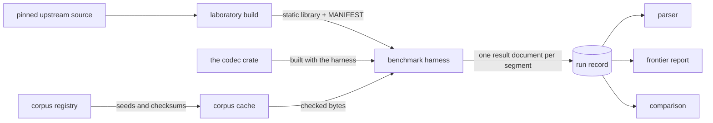

# Benchmarks

This page states the measurement laboratory as it exists now, and the first measurement of
Entroq beside the competitors it was measured against.

Every number below comes from a sealed gate-tier record. **The gate tier is not the
publication tier, and nothing on this page is a claim that one codec beats another.** A
comparison claim needs a controlled machine and a publication-tier record, and neither exists
yet. Read every number with the scope stated beside it, and read the timing stability section
before reading any throughput as a property of a codec rather than of this machine.

## The measurement pipeline



The laboratory and the corpus cache live outside the repository. The registry that describes
the corpus and the pin that names each competitor commit are in the repository; the bytes
they describe are not.

The harness measures every codec in-process. A competitor goes through the library that
project publishes, linked from the laboratory at build time; Entroq goes through the crate of
this workspace, built with the harness. Both cross one call and one process, so neither side
of a comparison is charged for a boundary the other does not pay.

It does not run a competitor's command line tool: a process invocation costs milliseconds, the
codec work at every size class up to the large one costs less, and two of the five competitors
publish no tool at all. There is no Entroq command line tool to run either.

## Competitors

Each competitor is built from the commit behind its release tag, as a static library, with
the release configuration its own project recommends.

| Codec | Version | Upstream commit |
|---|---|---|
| LZ4 | v1.10.0 | `ebb370ca83af193212df4dcbadcc5d87bc0de2f0` |
| Zstandard | v1.5.7 | `f8745da6ff1ad1e7bab384bd1f9d742439278e99` |
| Brotli | v1.2.0 | `028fb5a23661f123017c060daa546b55cf4bde29` |
| Snappy | 1.2.2 | `6af9287fbdb913f0794d0148c6aa43b58e63c8e3` |
| zlib | v1.3.2 | `da607da739fa6047df13e66a2af6b8bec7c2a498` |

A build carries a manifest stating how it was produced, including the build command, the
compiler version, the architecture, and the checksum of every library the linker is given. A
build with no manifest cannot appear in a result. A pinned build is never rebuilt in place: a
new build of the same project takes a new version directory, so an old result keeps pointing
at the build that produced it.

A rebuild from a manifest reproduces behavior, not bytes. Every rebuilt archive has exactly
the size of the one it was compared against and differs from it in a few tens of bytes out of
tens or hundreds of kilobytes. Each build records that measurement: the size, the differing
byte count, and the first differing offsets. The manifest checksum identifies the artifact a
result was produced with. It is not a claim that the build is bit reproducible.

## Operating points

A competitor is measured across the points its project exposes, not at one default level.
Entroq exposes one, because this revision admits no mode: it ships one match finder, one
parser, one representation, and one block length.

| Codec | Points | Groups |
|---|---|---|
| Entroq | `default` | `default` |
| LZ4 | `fast-1`, `fast-3`, `fast-5`, `fast-9`, `hc-1`, `hc-4`, `hc-9`, `hc-12` | `fast`, `hc` |
| Zstandard | `level-1`, `level-3`, `level-6`, `level-9`, `level-12`, `level-15`, `level-19`, `level-22` | `low`, `high`, `max` |
| Brotli | `q0`, `q2`, `q5`, `q9`, `q11` | `low`, `high`, `max` |
| Snappy | `default` | `default` |
| zlib | `level-1`, `level-6`, `level-9` | `low`, `high` |

The cost of one point spans three orders of magnitude inside one project, so the points of a
competitor are grouped by cost. A segmented campaign measures one group and one size class per
segment, which is what keeps each segment inside its budget.

## Corpus

The registry states the source, the checksum, the size, the class, and the license of every
entry. A project entry is generated from a recorded seed through a sequence this repository
owns, and generating it twice into two directories produces the same bytes. A public entry is
fetched from its distributor and checked against a recorded checksum as the archive arrives
and again on the bytes it unpacks to.

An entry whose license cannot be established is not registered.

| Group | Entries | Classes covered | License |
|---|---|---|---|
| `project` | 19 generated entries: JSON, source, logs, database rows, serialized binary, mixed, short tokens, long repetitions, sparse, zeros, high entropy, already compressed, and a large blob | tiny, small, medium, large | MIT OR Apache-2.0 |
| `gutenberg` | 3 English literary texts | medium, large | Project Gutenberg License |
| `enwik` | the enwik8 snapshot | large | GFDL-1.2-only |
| `sourcecode` | `go-source`, a pinned source tree | huge | BSD-3-Clause |

| Class | Size |
|---|---|
| `tiny` | under 1 KiB |
| `small` | 1 KiB to 64 KiB |
| `medium` | 64 KiB to 4 MiB |
| `large` | 4 MiB to 100 MiB |
| `huge` | 100 MiB and above, streamed |

Run `entroq-bench corpus list --all` for the registry, including the checksum and license of
every entry.

## Metrics

Every metric is reported with the call that produced it, or as unavailable with the reason.
No metric is reported as a zero, and no absent metric is omitted.

| Metric | Unit | Entroq | Competitors |
|---|---|---|---|
| `compressed_bytes` | bytes | measured | measured |
| `compression_ratio` | input bytes per compressed byte | measured | measured |
| `encode_throughput` | bytes per second | measured | measured |
| `decode_throughput` | bytes per second | measured | measured |
| `peak_rss` | bytes | measured, for the harness process | measured, for the harness process |
| `codec_owned_bytes` | bytes | measured, from `Encoder::steady_state_bytes` | measured for Brotli, LZ4, zlib and Zstandard. Snappy publishes no state-size call and no allocator hook |
| `decoder_owned_bytes` | bytes | measured, from `Decoder::steady_state_bytes` | measured for Zstandard alone. Brotli, LZ4, Snappy and zlib publish no decoder state size |
| `allocations` | allocations | measured through the harness allocator, which every Entroq allocation passes through, on one entry per size class | measured through the harness allocator, for Brotli, LZ4, zlib and Zstandard, on one entry per size class |
| `encode_first_output_latency` | nanoseconds | measured through the streaming encoder, on one entry per size class | measured for Brotli, LZ4, zlib and Zstandard, on one entry per size class. Snappy publishes no streaming interface |
| `encode_streaming_latency` | nanoseconds | measured on the same basis | measured on the same basis |
| `parallel_scaling` | ratio | N/A, no parallel path. This revision is single threaded and publishes no thread parameter | measured for Zstandard alone. Brotli, LZ4, Snappy and zlib publish no thread parameter |
| `encode_cycles_per_byte` | cycles per byte | N/A on every host this project reaches | N/A on every host this project reaches |
| `decode_cycles_per_byte` | cycles per byte | N/A on every host this project reaches | N/A on every host this project reaches |
| `instructions_per_byte` | instructions per byte | N/A on every host this project reaches | N/A on every host this project reaches |
| `random_range_latency` | nanoseconds | N/A, no range read | N/A, no competitor measured here publishes a range read |
| `range_amplification` | ratio | N/A, no range read | N/A, same reason |

The three counter metrics need a performance monitor unit the process may read. The
performance monitor registers trap at the user exception level on the development host,
`perf_event_open` is a Linux call that does not exist on it, and a shared runner usually
denies the counter. A cycle count is never derived from elapsed time and a nominal frequency:
a host that scales frequency, or that mixes core types, makes that product a number with no
meaning.

## Measured numbers

Source: `2026-09-18-03-bench-baseline`, a gate-tier record sealed at one revision, 48 of 48
segments, 473 seconds. The record holds 572 measured rows over 22 corpus entries: 22 Entroq
rows, one per entry at the one operating point this revision exposes, and 550 competitor rows.
The six tables below are the entries that show the most about codec behavior; the record holds
the rest.

Every row of every table shares this scope:

```text
machine       Apple M1 Pro, 10 cores, 16 GiB, macOS Darwin 25.5.0, aarch64
build         release profile, rustc 1.98.1
Entroq        encoder version 0.0.0, at the Entroq revision the record names. One frame,
              resource class small, regions independent, a window of 65 536 bytes, a region
              of 1 048 576 input bytes, a block of 65 536 input bytes
competitors   LZ4 v1.10.0, Zstandard v1.5.7, Brotli v1.2.0, Snappy 1.2.2, zlib v1.3.2,
              each built from the commit named above
threads       1
integrity     none, for all six
measurement   the call alone, in-process, median of the samples the tier bought
tier          gate. Not a published number, and not a claim about any codec
```

`Ratio` is input bytes per compressed byte, so higher compresses more. `spread` is the
slowest sample minus the fastest, over the median, inside one segment. It is a within-run
figure and it does not bound the movement between runs. A spread above about 0.15 means the
throughput beside it did not repeat closely even within its own segment.

### project-source-small

Source text at the small class. Small class, 32768 bytes.

| Codec | Point | Ratio | Compressed bytes | Encode MB/s | Encode spread | Decode MB/s | Decode spread |
|---|---|---:|---:|---:|---:|---:|---:|
| Entroq | `default` | 15.830 | 2070 | 282.6 | 0.051 | 477.0 | 0.023 |
| LZ4 | `fast-1` | 5.587 | 5865 | 1881.4 | 0.003 | 6754.9 | 0.003 |
| LZ4 | `fast-3` | 5.599 | 5852 | 1928.1 | 0.006 | 7007.7 | 0.038 |
| LZ4 | `fast-5` | 5.496 | 5962 | 1952.9 | 0.005 | 7109.6 | 0.002 |
| LZ4 | `fast-9` | 5.351 | 6124 | 2057.5 | 0.189 | 7120.4 | 0.075 |
| LZ4 | `hc-1` | 8.478 | 3865 | 2058.2 | 0.011 | 11085.3 | 0.003 |
| LZ4 | `hc-4` | 14.397 | 2276 | 505.9 | 0.055 | 20004.9 | 0.014 |
| LZ4 | `hc-9` | 14.888 | 2201 | 356.3 | 0.046 | 20647.8 | 0.008 |
| LZ4 | `hc-12` | 15.170 | 2160 | 47.3 | 0.020 | 20884.6 | 0.003 |
| Snappy | `default` | 6.861 | 4776 | 2628.8 | 0.004 | 6716.1 | 0.003 |
| zlib | `level-1` | 10.304 | 3180 | 969.8 | 0.280 | 1536.0 | 0.034 |
| zlib | `level-6` | 19.692 | 1664 | 297.7 | 0.099 | 2439.4 | 0.055 |
| zlib | `level-9` | 19.859 | 1650 | 190.4 | 0.126 | 2460.6 | 0.114 |
| Zstandard | `level-1` | 11.130 | 2944 | 1018.7 | 0.018 | 2793.3 | 0.016 |
| Zstandard | `level-3` | 14.309 | 2290 | 1414.8 | 0.018 | 3769.9 | 0.021 |
| Zstandard | `level-6` | 16.744 | 1957 | 318.1 | 0.104 | 4380.2 | 0.016 |
| Zstandard | `level-9` | 19.230 | 1704 | 208.3 | 0.114 | 5005.8 | 0.012 |
| Zstandard | `level-12` | 19.692 | 1664 | 67.1 | 0.031 | 5535.1 | 0.045 |
| Zstandard | `level-15` | 20.818 | 1574 | 10.1 | 0.027 | 5183.2 | 0.016 |
| Zstandard | `level-19` | 21.347 | 1535 | 1.8 | 0.029 | 5219.5 | 0.033 |
| Zstandard | `level-22` | 21.347 | 1535 | 1.9 | 0.004 | 5560.5 | 0.009 |
| Brotli | `q0` | 8.219 | 3987 | 1288.6 | 0.012 | 1136.8 | 0.016 |
| Brotli | `q2` | 11.405 | 2873 | 531.6 | 0.054 | 1487.7 | 0.026 |
| Brotli | `q5` | 19.219 | 1705 | 263.6 | 0.081 | 2803.8 | 0.024 |
| Brotli | `q9` | 21.154 | 1549 | 230.4 | 0.123 | 3064.1 | 0.028 |
| Brotli | `q11` | 22.291 | 1470 | 0.8 | 0.004 | 2660.2 | 0.021 |

### project-json-medium

JSON records, generated from a recorded seed. Medium class, 262144 bytes.

| Codec | Point | Ratio | Compressed bytes | Encode MB/s | Encode spread | Decode MB/s | Decode spread |
|---|---|---:|---:|---:|---:|---:|---:|
| Entroq | `default` | 5.792 | 45262 | 114.0 | 0.007 | 214.4 | 0.022 |
| LZ4 | `fast-1` | 3.641 | 71999 | 898.9 | 0.131 | 4402.7 | 0.022 |
| LZ4 | `fast-3` | 3.455 | 75871 | 922.0 | 0.064 | 4503.5 | 0.049 |
| LZ4 | `fast-5` | 3.396 | 77203 | 995.3 | 0.076 | 4639.7 | 0.030 |
| LZ4 | `fast-9` | 3.292 | 79641 | 969.7 | 0.046 | 4629.5 | 0.040 |
| LZ4 | `hc-1` | 3.886 | 67466 | 536.6 | 0.035 | 4336.0 | 0.048 |
| LZ4 | `hc-4` | 4.880 | 53723 | 156.0 | 0.020 | 5286.9 | 0.061 |
| LZ4 | `hc-9` | 5.330 | 49180 | 48.6 | 0.036 | 6587.9 | 0.070 |
| LZ4 | `hc-12` | 5.412 | 48438 | 17.4 | 0.034 | 6348.7 | 0.095 |
| Snappy | `default` | 3.397 | 77166 | 1170.5 | 0.159 | 3681.4 | 0.005 |
| zlib | `level-1` | 4.801 | 54601 | 319.0 | 0.052 | 779.1 | 0.050 |
| zlib | `level-6` | 6.515 | 40236 | 97.8 | 0.020 | 924.4 | 0.055 |
| zlib | `level-9` | 6.831 | 38376 | 34.7 | 0.011 | 942.3 | 0.078 |
| Zstandard | `level-1` | 5.595 | 46852 | 658.1 | 0.030 | 1908.2 | 0.079 |
| Zstandard | `level-3` | 5.478 | 47853 | 525.0 | 0.092 | 1925.2 | 0.041 |
| Zstandard | `level-6` | 6.423 | 40816 | 151.6 | 0.018 | 2381.3 | 0.069 |
| Zstandard | `level-9` | 7.068 | 37089 | 71.1 | 0.026 | 2610.6 | 0.105 |
| Zstandard | `level-12` | 7.531 | 34809 | 25.3 | 0.020 | 2952.4 | 0.094 |
| Zstandard | `level-15` | 7.932 | 33049 | 7.2 | 0.088 | 2863.6 | 0.097 |
| Zstandard | `level-19` | 7.995 | 32787 | 3.4 | 0.033 | 2918.1 | 0.103 |
| Zstandard | `level-22` | 7.995 | 32787 | 2.6 | 0.016 | 3122.3 | 0.106 |
| Brotli | `q0` | 4.313 | 60785 | 788.6 | 0.040 | 673.8 | 0.029 |
| Brotli | `q2` | 5.575 | 47018 | 283.0 | 0.041 | 764.6 | 0.040 |
| Brotli | `q5` | 6.706 | 39092 | 97.4 | 0.008 | 906.5 | 0.046 |
| Brotli | `q9` | 7.229 | 36263 | 51.4 | 0.005 | 972.4 | 0.056 |
| Brotli | `q11` | 8.416 | 31147 | 1.0 | 0.002 | 837.0 | 0.046 |

### project-source-medium

Rust and C source text, generated from a recorded seed. Medium class, 1048576 bytes.

| Codec | Point | Ratio | Compressed bytes | Encode MB/s | Encode spread | Decode MB/s | Decode spread |
|---|---|---:|---:|---:|---:|---:|---:|
| Entroq | `default` | 21.079 | 49746 | 263.3 | 0.007 | 544.4 | 0.010 |
| LZ4 | `fast-1` | 6.026 | 174021 | 1893.2 | 0.019 | 6210.7 | 0.034 |
| LZ4 | `fast-3` | 6.015 | 174315 | 1871.3 | 0.022 | 6192.4 | 0.012 |
| LZ4 | `fast-5` | 6.005 | 174622 | 1867.5 | 0.037 | 6207.6 | 0.029 |
| LZ4 | `fast-9` | 6.000 | 174773 | 1867.0 | 0.021 | 6278.9 | 0.032 |
| LZ4 | `hc-1` | 9.422 | 111293 | 2177.5 | 0.012 | 7760.0 | 0.024 |
| LZ4 | `hc-4` | 20.108 | 52146 | 408.1 | 0.026 | 12139.8 | 0.025 |
| LZ4 | `hc-9` | 24.835 | 42221 | 136.8 | 0.063 | 15927.8 | 0.047 |
| LZ4 | `hc-12` | 26.209 | 40008 | 37.7 | 0.034 | 14397.0 | 0.172 |
| Snappy | `default` | 7.196 | 145711 | 2526.4 | 0.036 | 6536.6 | 0.011 |
| zlib | `level-1` | 11.528 | 90957 | 684.5 | 0.026 | 1438.9 | 0.024 |
| zlib | `level-6` | 29.997 | 34956 | 250.1 | 0.012 | 2529.2 | 0.035 |
| zlib | `level-9` | 31.104 | 33712 | 135.0 | 0.006 | 2584.0 | 0.020 |
| Zstandard | `level-1` | 14.677 | 71445 | 1477.1 | 0.018 | 3550.5 | 0.039 |
| Zstandard | `level-3` | 17.101 | 61318 | 1638.5 | 0.034 | 4372.1 | 0.046 |
| Zstandard | `level-6` | 23.171 | 45253 | 303.0 | 0.036 | 5824.1 | 0.058 |
| Zstandard | `level-9` | 28.063 | 37365 | 234.3 | 0.032 | 7769.6 | 0.054 |
| Zstandard | `level-12` | 33.152 | 31629 | 133.2 | 0.028 | 8618.5 | 0.066 |
| Zstandard | `level-15` | 39.779 | 26360 | 48.6 | 0.026 | 11336.0 | 0.101 |
| Zstandard | `level-19` | 42.782 | 24510 | 2.1 | 0.012 | 11776.2 | 0.124 |
| Zstandard | `level-22` | 43.070 | 24346 | 2.2 | 0.004 | 12306.1 | 0.085 |
| Brotli | `q0` | 8.897 | 117852 | 1655.5 | 0.018 | 1218.0 | 0.008 |
| Brotli | `q2` | 13.068 | 80242 | 571.2 | 0.010 | 1489.5 | 0.021 |
| Brotli | `q5` | 26.484 | 39593 | 305.5 | 0.017 | 3229.3 | 0.045 |
| Brotli | `q9` | 36.194 | 28971 | 149.6 | 0.005 | 5010.1 | 0.054 |
| Brotli | `q11` | 40.558 | 25854 | 0.6 | 0.001 | 5284.7 | 0.090 |

### project-high-entropy-medium

Incompressible bytes, generated from a recorded seed. Medium class, 1048576 bytes.

| Codec | Point | Ratio | Compressed bytes | Encode MB/s | Encode spread | Decode MB/s | Decode spread |
|---|---|---:|---:|---:|---:|---:|---:|
| Entroq | `default` | 1.000 | 1048674 | 24.4 | 0.025 | 21165.8 | 0.034 |
| LZ4 | `fast-1` | 0.996 | 1052690 | 31378.5 | 0.212 | 55802.0 | 0.087 |
| LZ4 | `fast-3` | 0.996 | 1052690 | 29194.4 | 0.135 | 56299.4 | 0.074 |
| LZ4 | `fast-5` | 0.996 | 1052690 | 31655.1 | 0.223 | 55310.5 | 0.092 |
| LZ4 | `fast-9` | 0.996 | 1052690 | 31496.3 | 0.163 | 56049.6 | 0.085 |
| LZ4 | `hc-1` | 0.996 | 1052690 | 34568.8 | 0.132 | 56935.2 | 0.120 |
| LZ4 | `hc-4` | 0.996 | 1052681 | 57.9 | 0.004 | 40009.8 | 0.038 |
| LZ4 | `hc-9` | 0.996 | 1052681 | 57.7 | 0.005 | 40136.9 | 0.030 |
| LZ4 | `hc-12` | 0.996 | 1052681 | 47.5 | 0.001 | 40329.8 | 0.034 |
| Snappy | `default` | 1.000 | 1048627 | 34008.2 | 0.012 | 64695.0 | 0.139 |
| zlib | `level-1` | 1.000 | 1048896 | 66.9 | 0.015 | 59775.2 | 0.036 |
| zlib | `level-6` | 1.000 | 1048896 | 62.9 | 0.007 | 58661.6 | 0.042 |
| zlib | `level-9` | 1.000 | 1048896 | 62.8 | 0.004 | 64365.4 | 0.153 |
| Zstandard | `level-1` | 1.000 | 1048610 | 9834.2 | 0.247 | 59778.6 | 0.088 |
| Zstandard | `level-3` | 1.000 | 1048609 | 8248.4 | 0.036 | 60062.8 | 0.122 |
| Zstandard | `level-6` | 1.000 | 1048609 | 4784.4 | 0.040 | 60495.9 | 0.103 |
| Zstandard | `level-9` | 1.000 | 1048609 | 4420.5 | 0.126 | 59493.7 | 0.054 |
| Zstandard | `level-12` | 1.000 | 1048609 | 4081.4 | 0.087 | 62601.6 | 0.122 |
| Zstandard | `level-15` | 1.000 | 1048609 | 505.7 | 0.029 | 61381.3 | 0.083 |
| Zstandard | `level-19` | 1.000 | 1048609 | 34.9 | 0.058 | 62292.9 | 0.280 |
| Zstandard | `level-22` | 1.000 | 1048609 | 40.7 | 0.025 | 63388.7 | 0.103 |
| Brotli | `q0` | 1.000 | 1048581 | 10736.3 | 0.030 | 24745.2 | 0.178 |
| Brotli | `q2` | 1.000 | 1048581 | 2472.8 | 0.012 | 25317.5 | 0.026 |
| Brotli | `q5` | 1.000 | 1048581 | 937.1 | 0.006 | 24793.7 | 0.130 |
| Brotli | `q9` | 1.000 | 1048581 | 342.4 | 0.010 | 24941.7 | 0.132 |
| Brotli | `q11` | 1.000 | 1048581 | 4.4 | 0.026 | 24843.1 | 0.032 |

### gutenberg-shakespeare

English literary text, the complete works of Shakespeare. Large class, 5638480 bytes.

| Codec | Point | Ratio | Compressed bytes | Encode MB/s | Encode spread | Decode MB/s | Decode spread |
|---|---|---:|---:|---:|---:|---:|---:|
| Entroq | `default` | 2.577 | 2188080 | 49.4 | 0.016 | 100.5 | 0.003 |
| LZ4 | `fast-1` | 1.598 | 3527975 | 447.2 | 0.003 | 3749.0 | 0.007 |
| LZ4 | `fast-3` | 1.455 | 3874515 | 534.4 | 0.002 | 3743.8 | 0.004 |
| LZ4 | `fast-5` | 1.345 | 4191284 | 635.1 | 0.008 | 3640.5 | 0.003 |
| LZ4 | `fast-9` | 1.236 | 4562723 | 818.7 | 0.002 | 3788.5 | 0.005 |
| LZ4 | `hc-1` | 1.909 | 2953359 | 253.2 | 0.029 | 2719.3 | 0.036 |
| LZ4 | `hc-4` | 2.207 | 2555370 | 66.9 | 0.062 | 3130.1 | 0.016 |
| LZ4 | `hc-9` | 2.283 | 2469328 | 27.2 | 0.014 | 3207.1 | 0.012 |
| LZ4 | `hc-12` | 2.313 | 2438082 | 14.8 | 0.008 | 3232.7 | 0.004 |
| Snappy | `default` | 1.643 | 3430938 | 514.2 | 0.029 | 1899.7 | 0.008 |
| zlib | `level-1` | 2.232 | 2526146 | 123.5 | 0.004 | 367.0 | 0.006 |
| zlib | `level-6` | 2.637 | 2138320 | 25.0 | 0.008 | 386.7 | 0.006 |
| zlib | `level-9` | 2.650 | 2127930 | 19.5 | 0.001 | 387.7 | 0.003 |
| Zstandard | `level-1` | 2.337 | 2412580 | 416.4 | 0.008 | 1407.6 | 0.012 |
| Zstandard | `level-3` | 2.679 | 2104953 | 214.6 | 0.059 | 1228.8 | 0.025 |
| Zstandard | `level-6` | 2.873 | 1962341 | 86.1 | 0.041 | 1315.9 | 0.007 |
| Zstandard | `level-9` | 2.965 | 1901851 | 52.5 | 0.114 | 1351.3 | 0.034 |
| Zstandard | `level-12` | 3.046 | 1850924 | 27.2 | 0.051 | 1544.5 | 0.009 |
| Zstandard | `level-15` | 3.130 | 1801201 | 5.2 | 0.104 | 1567.2 | 0.020 |
| Zstandard | `level-19` | 3.334 | 1691406 | 3.5 | 0.059 | 1457.1 | 0.094 |
| Zstandard | `level-22` | 3.334 | 1691408 | 3.4 | 0.017 | 1525.3 | 0.007 |
| Brotli | `q0` | 2.274 | 2479566 | 316.4 | 0.004 | 309.3 | 0.003 |
| Brotli | `q2` | 2.565 | 2198605 | 133.5 | 0.001 | 370.2 | 0.003 |
| Brotli | `q5` | 2.913 | 1935540 | 52.5 | 0.007 | 447.0 | 0.003 |
| Brotli | `q9` | 3.108 | 1814427 | 17.2 | 0.043 | 516.7 | 0.006 |
| Brotli | `q11` | 3.367 | 1674501 | 0.8 | 0.000 | 516.9 | 0.008 |

### project-logs-large

Line-oriented application logs, generated from a recorded seed. Large class, 8388608 bytes.

| Codec | Point | Ratio | Compressed bytes | Encode MB/s | Encode spread | Decode MB/s | Decode spread |
|---|---|---:|---:|---:|---:|---:|---:|
| Entroq | `default` | 4.333 | 1936150 | 82.7 | 0.008 | 168.3 | 0.068 |
| LZ4 | `fast-1` | 2.874 | 2918436 | 809.6 | 0.016 | 4830.6 | 0.004 |
| LZ4 | `fast-3` | 2.667 | 3144767 | 902.9 | 0.001 | 4886.9 | 0.004 |
| LZ4 | `fast-5` | 2.716 | 3089031 | 932.0 | 0.003 | 4810.1 | 0.003 |
| LZ4 | `fast-9` | 2.509 | 3343188 | 971.7 | 0.041 | 4727.5 | 0.031 |
| LZ4 | `hc-1` | 3.130 | 2680172 | 354.1 | 0.010 | 4094.8 | 0.002 |
| LZ4 | `hc-4` | 3.649 | 2298760 | 119.9 | 0.045 | 4197.6 | 0.002 |
| LZ4 | `hc-9` | 3.855 | 2176141 | 43.9 | 0.014 | 4775.3 | 0.005 |
| LZ4 | `hc-12` | 3.916 | 2142253 | 17.7 | 0.021 | 4097.8 | 0.006 |
| Snappy | `default` | 2.693 | 3114991 | 1048.2 | 0.007 | 3471.5 | 0.005 |
| zlib | `level-1` | 3.699 | 2267654 | 242.6 | 0.011 | 617.3 | 0.004 |
| zlib | `level-6` | 4.793 | 1750314 | 73.6 | 0.016 | 677.1 | 0.004 |
| zlib | `level-9` | 5.018 | 1671738 | 34.4 | 0.001 | 690.4 | 0.007 |
| Zstandard | `level-1` | 4.478 | 1873220 | 625.7 | 0.011 | 1789.4 | 0.010 |
| Zstandard | `level-3` | 4.428 | 1894602 | 406.7 | 0.022 | 1889.3 | 0.009 |
| Zstandard | `level-6` | 5.020 | 1670950 | 126.6 | 0.025 | 2199.8 | 0.013 |
| Zstandard | `level-9` | 5.348 | 1568556 | 80.8 | 0.070 | 2420.3 | 0.034 |
| Zstandard | `level-12` | 5.527 | 1517666 | 39.9 | 0.046 | 2549.3 | 0.026 |
| Zstandard | `level-15` | 5.713 | 1468351 | 9.9 | 0.030 | 2720.6 | 0.027 |
| Zstandard | `level-19` | 6.164 | 1360813 | 3.1 | 0.018 | 2650.1 | 0.060 |
| Zstandard | `level-22` | 6.164 | 1360813 | 3.4 | 0.011 | 3029.3 | 0.033 |
| Brotli | `q0` | 3.664 | 2289283 | 612.4 | 0.049 | 558.8 | 0.005 |
| Brotli | `q2` | 4.297 | 1952286 | 229.6 | 0.058 | 651.8 | 0.005 |
| Brotli | `q5` | 5.236 | 1602023 | 83.8 | 0.039 | 751.1 | 0.005 |
| Brotli | `q9` | 5.556 | 1509696 | 30.1 | 0.016 | 812.2 | 0.010 |
| Brotli | `q11` | 6.337 | 1323781 | 0.9 | 0.000 | 715.3 | 0.032 |

### Reading these tables

The ratios are properties of the bytes. They reproduce exactly, run to run, and the compressed
length beside each one is what the codec actually stored.

The throughputs are not stable in the same way. They reproduce at the cheap operating points
and move by up to about a fifth at the expensive ones, in one direction, between runs on this
machine. Treat a throughput here as the order of magnitude and the shape of the curve, not as
a value to compare against another published figure. The timing stability section below states
what that costs.

### Where Entroq sits, on this machine, at this revision

This is a description of one gate-tier record. It is not a frontier claim, and no operating
point here is claimed against any competitor.

**The ratio is around Zstandard levels 1 to 6.** On the six entries above, Entroq's single
operating point lands between two adjacent Zstandard levels every time:

| Entry | Entroq ratio | Falls between |
|---|---:|---|
| project-source-small | 15.830 | Zstandard `level-3` 14.309 and `level-6` 16.744 |
| project-json-medium | 5.792 | Zstandard `level-1` 5.595 and `level-6` 6.423 |
| project-source-medium | 21.079 | Zstandard `level-3` 17.101 and `level-6` 23.171 |
| gutenberg-shakespeare | 2.577 | Zstandard `level-1` 2.337 and `level-3` 2.679 |
| project-logs-large | 4.333 | Zstandard `level-1` 4.478, just below it |
| project-high-entropy-medium | 1.000 | every codec here, which stores incompressible input |

**The encode throughput is in the same band as the Zstandard level it matches on ratio.** On
project-source-medium, Entroq encodes at 263 MB/s against Zstandard `level-6` at 303 MB/s, at
a ratio of 21.1 against 23.2.

**The decode throughput is an order of magnitude below every competitor at a comparable
ratio.** On project-source-medium, Entroq decodes at 544 MB/s and Zstandard `level-6` at
5824 MB/s. The gap is between eight and thirteen times on every compressible entry above. This
project's stated priority is decode-first, so this is the number that matters most and the one
furthest from where it needs to be. Nothing in the format requires it: the gap is in this
revision's decoder, which allocates a symbol vector per stream and copies each suffix section
per block. The performance pass owns it.

**On incompressible input the encoder is slow, and the reason is the selection rule.** Entroq
encodes project-high-entropy-medium at 24 MB/s, where LZ4 `fast-1` reaches 31 379 MB/s and
Snappy 34 008 MB/s. The rule assembles every block type a block admits and emits the cheapest,
so an incompressible block pays for a match search, a parse, and four entropy-coded candidate
streams before it is emitted as RAW. It stores the right bytes — the ratio is 1.000 and the
frame is 98 bytes above its content — and it pays full price to decide that. No cheap
early-out exists yet.

**The memory figures are the ones a competitor mostly cannot report.** Entroq states 3 080 308
bytes of encoder steady state and 327 716 bytes of decoder steady state, from the machines
themselves, at every entry. Of the five competitors, four publish an encoder state size and one
publishes a decoder state size.

## Fairness

A comparison measures equivalent work, or it is not a comparison. Every result states each
axis:

| Axis | Setting |
|---|---|
| input bytes | the same registered entry, by digest, for every codec |
| operating semantics | one-shot compression of a whole buffer, then decompression of it |
| integrity | none, for all six. Each competitor is driven through a format of its own project that carries no checksum. Entroq declares integrity absent, and version 1 of its format defines the position and the width of an integrity field and computes nothing into it. Each result names the checksum it was not produced under |
| resource limits | the library default for each project. Entroq runs at its conservative decoder policy, resource class small, a window of 65 536 bytes |
| threads | 1, except the parallel scaling metric, which states its own worker count |
| warm-up | the same sampling procedure for every codec |
| measured interval | the call alone, inside one process, for every codec |

The integrity axis matters: a codec that checksums less is not faster for free. None of the
six was measured with a checksum enabled, so none is credited or charged for one. Entroq is
the one that has no checksum to enable yet, and that is a gap and not a setting: when the
integrity algorithm exists, the comparison has to be re-read with it on.

The boundary axis matters as much. Entroq is not measured through a thinner interface than
the competitors: every codec here is driven in-process through the API its own project
publishes, and the measured interval is the call and nothing around it.

## Tiers

| Tier | Input budget | Duration | Recorded | What a number licenses |
|---|---|---|---|---|
| `smoke` | 1 MiB | 30 s | no | nothing. It proves the harness runs and produces a parseable result. Its numbers are ignored |
| `dev` | 10 MiB per codec path | 120 s, one segment | yes | direction on one machine, from few samples, at the default operating point of each project. It describes no frontier, and no dev number appears in documentation, in a release note, or in a comparison claim |
| `gate` | 100 MiB per codec path | segmented | yes | a milestone gate. It measures every pinned operating point across the size classes its budget reaches, with repeated samples and a reported spread. The numbers on this page come from this tier. They are scoped to the machine that produced them, and they are not a comparison claim |
| `publication` | full corpora | segmented, authorized | yes | the only tier a number may leave the repository from, and only from a sealed record |

No validation step runs longer than 120 seconds. A campaign that needs more time is split
into segments, not given more time. A segment that overruns is a defect in the run design, and
the budget does not move to accommodate it.

## Records

Every recorded tier writes a manifest of what was requested, an append-only journal with one
line per segment attempt, the raw output of every segment, and a summary written when the
campaign seals. A campaign is sealed when every segment passed, at one revision, against one
recorded input set. Only a sealed record is evidence.

A record holds the command of every segment, so a campaign is reproducible from the record
alone. Records live outside the repository. A run writes nothing inside it.

Three commands read a record:

```sh
entroq-bench report parse   --results <record>                       # read it, whole or not at all
entroq-bench report pareto  --results <record>                       # mark every dominated point
entroq-bench report compare --baseline <record> --results <record>   # did the second reproduce the first
```

`report parse` rejects a document that carries a field it does not declare or omits one it
does, rather than reading it in part. A field skipped is a metric dropped, and a dropped metric
reads as an absent one.

`report compare` reads its tolerance from the first record and chooses none of its own. A
number that is a property of the bytes has no variance, so any difference in it is a finding. A
number that is a timing is judged against the spread the first record states for the block it
came from. A number that moves between runs and that no record states a variance for is
reported with its difference and no verdict.

## Reproducibility

An earlier gate-tier campaign has been reproduced from its own record on a clean checkout, with
the laboratory rebuilt from the pinned commits and the corpus restored from the registry.
Neither the laboratory nor the corpus of the first campaign was reachable from the second.

All 550 competitor rows matched on competitor, operating point, corpus entry, size class, and
thread count, over inputs agreeing by digest, through libraries of the same version. No pair
was rejected as measuring different work, no row existed in one campaign alone, and the two
records disagreed about no field of the host.

The campaign on this page was itself run twice, at two revisions whose codec bytes are the
same. All 572 rows, the 22 Entroq rows included, reproduced their compressed length, their
compression ratio, and their encoder and decoder state size exactly: 0 of 572 differ on each.
221 encode throughputs and 205 decode throughputs moved outside the spread the first record
states, by up to 38 per cent, which is the host property the section below describes.

The ratios beside the Entroq rows are the ones this encoder version writes. A later encoder
version is free to change them without changing what a decoder accepts.

Every metric that is a property of the bytes reproduced identically, not within a tolerance:
compressed length, compression ratio, encoder state size, decoder state size, and allocation
count, on every row that carried them.

## Timing stability

Throughput did not reproduce inside the spread the first record states. This is a property of
the host, and it is stated here so that no future number from an uncontrolled machine is read
as more stable than it is.

The movement between two campaigns has one direction and rises with the cost of the operating
point. At the cheapest points it is under two percent. At the most expensive it reaches about
a fifth. Re-measuring the most-moved block three further times placed it with the second
campaign, not the first, which makes the first campaign's value at that point the one the host
does not return to.

The spread a result reports is taken from samples seconds apart inside one segment, under one
machine state. It does not bound the movement between runs on different days, and the gap
between the two grows with the cost of the operating point.

This is why the numbers on this page carry their spread and their machine, and why none of
them is stated as a comparison claim. A claim that one codec is faster than another needs a
controlled machine and a publication-tier record. Neither exists yet.

## What this laboratory does not answer

```text
GAP: no host this project reaches grants a cycle count or an instruction count.

Known:
- The performance monitor registers trap at the user exception level on the
  development host. Measured.
- `perf_event_open` is a Linux call and does not exist on that host. A shared
  runner usually denies the counter.

Unknown:
- Whether any host this project can reach grants counter access.

Blocks:
- The three counter metrics, on every host this project has.
- The two frontier axes read against encode CPU and decode CPU. Both report no
  data rather than substituting elapsed time.
```

```text
GAP: the decode throughput is an order of magnitude below every competitor at
a comparable ratio.

Known:
- Measured above, on every compressible entry of the record: between eight
  and thirteen times below Zstandard at the level Entroq matches on ratio.
  Reproduced across two campaigns.
- Nothing in the format requires it. This revision's decoder allocates a
  symbol vector per stream and copies each suffix section, per block.
- Decode-first is a stated project priority, so this is the figure furthest
  from where it needs to be.

Unknown:
- How much of the gap the per-block allocations account for, and how much is
  the decomposition, the table shape, or the sequence loop.

Blocks:
- Any operating point being claimed against a competitor on a decode axis.
```

```text
GAP: the encoder pays full price to decide that an input is incompressible.

Known:
- Measured above: 24 MB/s on incompressible input, against 31 379 MB/s for
  LZ4 fast-1 and 34 008 MB/s for Snappy.
- The selection rule assembles every block type a block admits and emits the
  cheapest, so an incompressible block pays for a match search, a parse and
  four entropy-coded candidate streams before it is emitted as RAW.
- The bytes are right: the ratio is 1.000 and the frame is 98 bytes above its
  content.

Unknown:
- What an early-out would cost in ratio on content that is nearly
  incompressible rather than incompressible.

Blocks:
- Any operating point being claimed against a competitor on an
  already-compressed corpus entry.
```

```text
GAP: no publication-tier record exists.

Known:
- Every campaign so far is dev tier or gate tier. This includes every Entroq
  number on this page.
- A publication campaign needs a controlled machine and an authorization, and
  has had neither.
- The numbers on this page are gate tier, published with their scope and their
  spread, and stated as measurements of this machine rather than as claims.

Blocks:
- Any comparison claim, and any number quoted without the machine that
  produced it.
```

```text
GAP: throughput at an expensive operating point does not repeat on the
development host.

Known:
- Stated under Timing stability above.
- The host publishes no governor, boost, or thermal state a run can read or
  control, and every result records that.

Blocks:
- Reading a gate-tier throughput at an expensive operating point as a stable
  value.
- Any published comparison, until a controlled machine measures it.
```

```text
GAP: random-range latency and range-read amplification have no producer.

Known:
- No codec path in this repository produces a range read.
- No competitor measured here publishes one either.

Blocks:
- Both metrics. They wait for the Entroq index and the range decode path.
```
