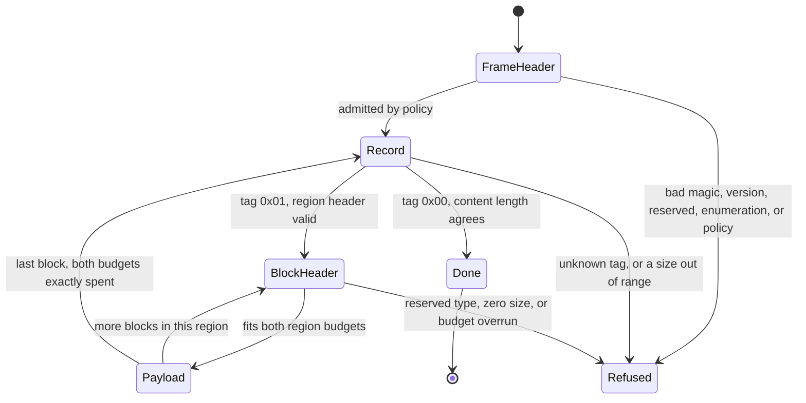

# Entroq Format

This page is the definition of an Entroq stream. It is written so that a decoder can be
built from it without reading Entroq source.

Version 1 carries no compression. Every byte of content travels either literally or as a
run, so a stream is a container with a validated structure rather than a compressed
representation. The structure is what this page specifies, and it is the structure the
compressed block types will arrive inside.

## Conventions

```text
byte order        little-endian, for every multi-byte field, everywhere
bit numbering     bit 0 is the least significant bit of the value it belongs to
offsets           counted in bytes from the start of the structure being described
sizes             counted in bytes
```

There is no alignment requirement and no padding. A structure begins at the byte after the
one before it ends.

A decoder reads every multi-byte field by byte position and shift. No field is a native
integer read through its in-memory representation, so a stream decodes to the same bytes on
every architecture.

Three terms are used exactly:

```text
logical bytes     content bytes, the bytes a structure decodes to
physical bytes    stream bytes, the bytes a structure occupies
content           the whole byte sequence a frame decodes to
```

## The shape of a stream

A stream is one frame. A frame is a header, then a sequence of records, then nothing.

```text
frame header
record           tag 0x01, a region header, and the blocks the region holds
record           ...
record           tag 0x00, the terminator
```

The terminator ends the frame. A decoder that has read it has read the whole frame, and
bytes after it are not part of the frame.

## Frame header

The header is 16 bytes, plus each optional field the flags declare.

```text
offset  size  field
     0     4  magic
     4     1  major version
     5     1  flags
     6     1  resource class
     7     1  integrity mode
     8     4  ignore-reserved bits
    12     4  reject-reserved bits
    16     8  logical content length     when flag bit 1 is set
     +     4  dictionary identifier      when flag bit 2 is set
     +     8  index location             when flag bit 3 is set
```

An optional field is present only when its flag bit is set, and present fields appear in the
order listed. A header therefore occupies 16, 20, 24, 28, 32, or 36 bytes, and 36 is the
widest header this version defines.

### magic

The four bytes `E7 51 B3 2A`, which is the little-endian encoding of `0x2AB351E7`.

The value is not a valid UTF-8 sequence and carries bytes outside the ASCII range, so a
frame is identifiable by inspection and is not mistaken for text.

A decoder that reads any other four bytes refuses the input as not being an Entroq frame.
This is the first check, before anything else in the header is examined.

### major version

The format major version. This page specifies version `1`.

The version is checked second, immediately after the magic and before any other field. A
decoder that does not implement the version it reads refuses the frame with an error that
names the version and is distinct from every other refusal. A reader can then tell "this is
a newer Entroq stream" from "this is damaged", which is a different action for the caller.

A major version is a decoder contract. Every field on this page is fixed at version 1.

### flags

One byte. Bits 0 to 3 are defined; bits 4 to 7 are reject-reserved.

```text
bit 0   region independence   0 dependent, 1 independent
bit 1   a logical content length is present
bit 2   a dictionary identifier is present
bit 3   an index location is present
bits 4 to 7  reject-reserved
```

**Region independence** states whether a region inherits anything from the region before it.
An independent region inherits nothing: no history, no entropy state, no offset history. It
can be decoded without decoding the region before it, which is what makes parallel decode
and random access possible. A dependent region continues the state its predecessor left.

Version 1 carries no state between regions under either setting, because no block type in
this version depends on any. The flag is decoded, carried, and declares the contract a
later block type will be held to.

### resource class

One byte, an enumerated value. It states the decoder history a frame requires, so a decoder
learns its memory requirement from one field and no arithmetic.

```text
0   64 KiB
1    1 MiB
2    8 MiB
3   64 MiB
4  256 MiB
```

Any other value is refused as corrupt. The class is enumerated rather than derived from a
window length so that every accepted value names a bound, and so that no expression stands
between a field a stream chose and the memory it implies.

The five members are **provisional**: the count and the byte figures can change before the
freeze. The field, its width, and the rule that an unlisted value is corrupt are not.

### integrity mode

One byte, an enumerated value.

```text
0  absent      no structure in the frame carries an integrity field
1  per-region  every region header carries an integrity field
```

Any other value is refused as corrupt. The mode is in the frame header rather than in each
region, so a decoder knows every region header's width before it reads one.

### reserved space

Reserved capacity is split by meaning, and the split is fixed at version 1.

```text
reject-reserved   flag bits 4 to 7, and the 4 bytes at offset 12
ignore-reserved   the 4 bytes at offset 8
```

**Reject-reserved space is corruption when it is set.** A stream that sets any of these bits
is refused. No future version defines them as a feature, so a set bit is damage and a
decoder is free to say so.

**Ignore-reserved space is where a future version puts a feature.** A bit here that the
decoder's version defines is honoured. A bit that it does not define is a well-formed
request for something this build does not implement, and is refused with an error that says
exactly that. Version 1 defines no bit in this space, so any set bit is an unimplemented
feature.

The two classes carry different errors so a caller can tell "damaged" from "newer than me"
without guessing. Under-reserving is the expensive direction, so the space is generous and
the width of each word is **provisional** until the freeze.

### logical content length

Eight bytes, present when flag bit 1 is set. It is the number of content bytes the whole
frame decodes to.

It is optional because a streaming encoder does not always know it when it writes the
header. When it is present a decoder must check the content it produced against it at the
terminator and refuse a frame that decoded to any other length. When it is absent the frame
is still complete: it simply does not say in advance how long it is.

A frame written with the field and a frame written without it decode to the same content.

### dictionary identifier

Four bytes, present when flag bit 2 is set. It names the dictionary the frame was built
against, by identity alone.

Version 1 attaches no semantics to the value. It is carried, and no block in this version
consults it. A decoder does not refuse a frame for carrying one, and does not need to hold
the dictionary it names in order to decode a version 1 frame.

### index location

Eight bytes, present when flag bit 3 is set. It is the offset in the stream at which the
index begins.

**The structure this field points at is not defined in version 1.** The field declares that
an index is present and where it starts; nothing in this version reads what is there. A
decoder decodes the frame by walking its records and does not consult the field. It is
**provisional** in full: the structure, its entries, and what a reader may do with it.

## Records

After the frame header, and after the last block of every region, the next byte is a record
tag.

```text
0x00  terminator
0x01  region, followed by a region header
```

Any other tag is refused as corrupt.

A tag is one byte, and the terminator is one byte and nothing else. The whole terminator is
that byte.

## Region header

A region header follows a `0x01` tag. It is 16 bytes, or 24 when the frame's integrity mode
is per-region.

```text
offset  size  field
     0     8  logical size
     8     8  physical size
    16     8  integrity field          when the integrity mode is per-region
```

**Logical size** is the content bytes this region decodes to. Zero is refused as corrupt: a
region that decodes to nothing has no reason to exist, and admitting it would admit an
unbounded run of them.

**Physical size** is the stream bytes this region's blocks occupy, counted from the byte
after this header. It does not include the tag or the header itself. A value below 5 is
refused as corrupt, because the smallest region a block can fill is one 4-byte block header
and one payload byte.

The physical size is what lets a reader reach the next record without an index: the next
record tag is exactly that many bytes after the header ends. A reader that only wants to
enumerate regions never reads a block.

Both widths are **provisional**.

**The integrity field is reserved and nothing computes it.** It is present when the frame
declares per-region integrity, it is eight bytes wide, and version 1 neither produces a
value for it nor checks one. The algorithm, and whether it covers the region's stream bytes,
its content bytes, or both, is not decided. A decoder at this version reads the field, does
not refuse a frame for any value in it, and does not treat it as a verification. The width
and the position are **provisional** with the algorithm that will fill them.

## Blocks

A region holds one or more blocks. Each is a 4-byte header followed by its payload.

The header is one little-endian 32-bit word:

```text
bit  0        last block in this region
bits 1 to 2   block type
bits 3 to 31  size
```

```text
type  meaning
   0  RAW, the payload is the content, byte for byte
   1  RLE, the payload is one byte, repeated to the declared size
   2  COMPRESSED, reserved for a compressed representation
   3  reserved and refused
```

**Size is the decoded size, for every block type.** It is the content bytes the block
produces, not the bytes it occupies. The stored payload is derived from the type:

```text
RAW  stores size bytes
RLE  stores exactly 1 byte
```

That is what makes a run cost one byte rather than a length and a value: the length is
already in the header every block carries.

A size of zero is refused as corrupt. The field is 29 bits, so the largest size a block can
declare is `0x1FFFFFFF`, one byte short of 512 MiB. The width is **provisional**.

**Type 2 is refused as an unimplemented feature, not as corruption.** The type space
reserves it for compressed blocks and no version yet defines one, so a stream that asks for
one is well formed and asking for something this build cannot do. Type 3 is refused as
corrupt: no version can define it.

**Bit 0 marks the last block of the region.** A decoder that reads it has reached the end of
the region and the next byte is a record tag.

## What a region must add up to

The region header declares two budgets and the blocks must spend both exactly.

```text
sum of every block's header and stored payload  ==  physical size
sum of every block's decoded size               ==  logical size
```

A conforming decoder checks each block against what remains of both budgets **before** the
payload moves, not after the region ends. Concretely, at each block:

```text
the 4 header bytes must fit in the physical bytes that remain
the stored payload must fit in the physical bytes that remain after the header
the decoded size must fit in the logical bytes that remain
a block with bit 0 set must leave both remainders at exactly zero
a block with bit 0 clear must leave both remainders above zero
```

A region that contradicts its own header is refused at the block that overruns it. A
malformed region therefore costs the bytes of one block, not the bytes the header claimed.

## Decode order

A decoder is a small machine over the structures above. Nothing is read out of order, and
every field is validated by the structure that owns it, before anything depends on it.



Two properties of the machine are part of the contract, not of any implementation:

**A structure is validated at the boundary that owns it, before anything is sized from it.**
No length read from a stream sizes an allocation before the check that bounds it has run. A
decoder can be written so that parsing allocates nothing at all: every header is a
fixed-width value, and no payload has to be held to be expanded, since a literal is copied
through and a run is one byte and a fill.

**A frame is refused before it is decoded.** The frame header states the decoder history the
frame requires, and a decoder compares it to its own policy before it reads the first
record. A frame that asks for more than policy allows is refused with an error naming both
the requirement and the limit, having committed nothing.

## Truncation

A structure that the available bytes cannot complete is a truncation, not a corruption, and
the two are distinct outcomes.

A truncation reports the bytes the pending structure needs, counted from the start of the
input the structure was read from. For a record that count includes the tag, so a reader
that fills a buffer to the stated width holds a whole record and makes progress.

Truncation is not failure for a streaming reader: it means "bring more bytes". It becomes a
failure only when the bytes run out for good, and a stream that ends before its terminator
is incomplete. A decoder must not report success for one, and must not return content it
reached by assuming what the missing bytes would have been.

## How a decoder refuses

The refusals above fall into five classes. The class is part of the contract, because a
caller acts differently on each.

```text
not an Entroq frame     the magic does not match
unsupported version     the major version is not implemented
unsupported feature     well formed, and asks for something this build does not do:
                        an undefined ignore-reserved bit, a compressed block
corrupt data            the stream violates this page: a reject-reserved bit, a value
                        outside an enumeration, an undefined tag or block type, a size
                        out of range, a region that contradicts its header, a frame
                        whose content length does not match what it decoded
limit exceeded          the frame declares more than the caller's policy allows
truncated input         the structure needs more bytes than are available
```

No input of any kind causes a decoder to panic, to allocate without bound, to loop without
end, or to produce content beyond the buffer its caller supplied. Compressed input is
treated as chosen by an attacker, whatever the caller believes about its origin.

A decoder that has refused a stream stays refused. It reports the same failure to every
later call rather than resuming into a state the stream did not establish.

## Expansion bound

Version 1 stores content literally, so a frame is larger than its content by a bounded and
computable amount. The bound is exact, not an estimate:

```text
regions = ceil(logical / region_bytes)
blocks  = sum over regions of ceil(that region's logical / block_bytes)

total   = frame header bytes
        + regions * (1 + region header bytes)
        + blocks * 4
        + logical
        + 1
```

where the frame header is 16 bytes plus its optional fields, the region header is 16 bytes,
or 24 when the frame declares per-region integrity, and the trailing 1 is the terminator.

An empty frame is 17 bytes: a 16-byte header with no optional field, and the terminator.

`region_bytes` and `block_bytes` are not format constants. They are the sizes the encoder
chose, and every size a decoder needs is declared in a header it reads, so an encoder can
change them without changing what any decoder accepts. They appear in the bound because the
overhead is a function of how the content was divided, not of the content.

Worked at the sizes this encoder currently chooses — 1 MiB regions cut into 64 KiB blocks,
neither of which is a format constant — one full region costs 1 tag byte, 16 header bytes,
and 16 block headers, which is 81 bytes for 1 MiB of content, or about 0.008 per cent. A
whole-frame figure adds the 16-byte frame header and the terminator once.

The bound holds exactly at every size, including the ones that stress it: zero, one byte,
one byte either side of a block boundary, and one byte either side of a region boundary,
under both integrity modes.

## What is provisional

Every entry below is a width or a set of accepted values. None is a field's existence or its
meaning, and none changes the shape of a structure on this page.

| Provisional | What is fixed | What can still change |
|---|---|---|
| resource class members | the field, its width, and that an unlisted value is corrupt | how many classes there are, and the byte figure each names |
| region logical and physical size widths | that both are declared, and that both must be spent exactly | the width of each field |
| block size width | that size is the decoded size, and that zero is corrupt | the 29 bits the field occupies |
| reserved word widths | the split into reject-reserved and ignore-reserved, and the behaviour of each | how many bytes each class reserves |
| integrity field | its position, and that version 1 neither computes nor checks it | the algorithm, its width, and the bytes it covers |
| index | that the frame can declare one and say where it begins | the structure it points at, entirely |

## What version 1 does not define

```text
any compressed block representation
any entropy coding
the index structure the index location points at
the integrity algorithm, and the bytes it covers
dictionary semantics beyond carrying an identifier
```

A stream that asks for a compressed block, or sets an ignore-reserved bit, is well formed
and is refused as unimplemented. The other three are fields a version 1 frame can carry and
that a version 1 decoder does not act on.
