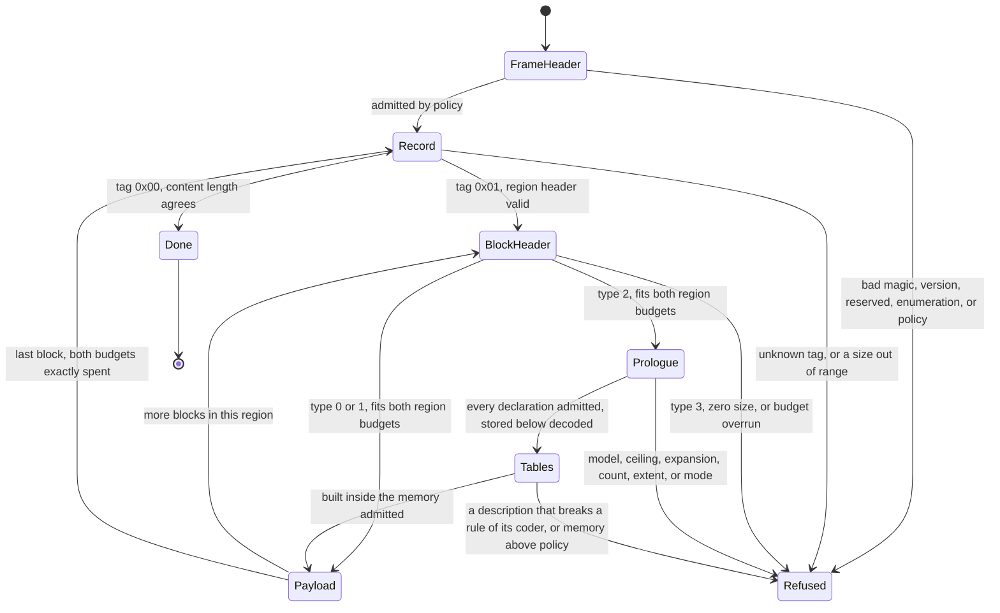
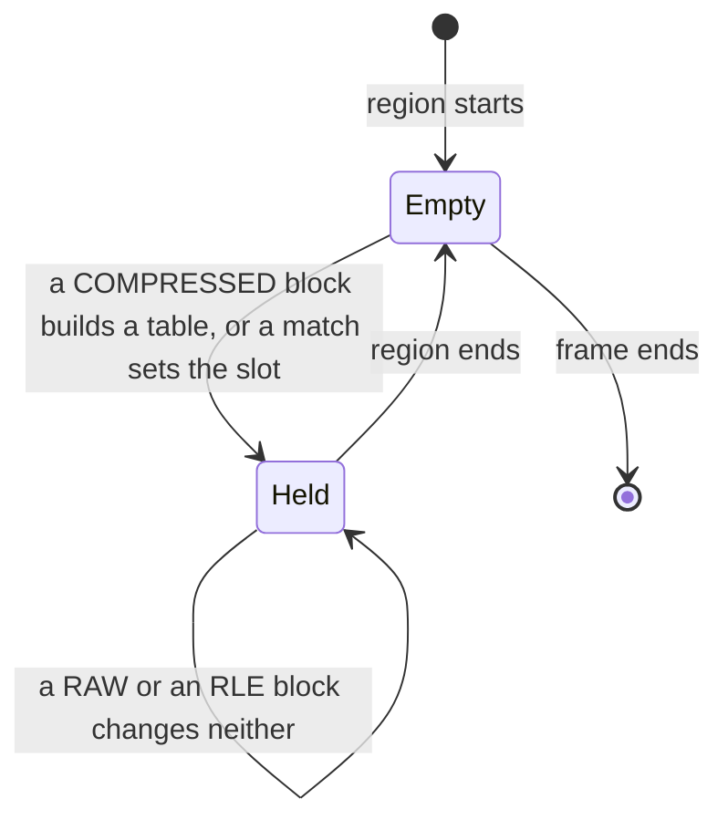

# Entroq Format

This page is the definition of an Entroq stream. It is written so that a decoder can be
built from it without reading Entroq source.

Version 1 carries three block types. A block stores its content literally, or as one repeated
byte, or as a compressed representation: four entropy coded symbol streams that a decoder
expands into literal runs and matches.

## Conventions

```text
byte order        little-endian, for every multi-byte field, everywhere
bit numbering     bit 0 is the least significant bit of the value it belongs to
offsets           counted in bytes from the start of the structure being described
sizes             counted in bytes
```

There is no alignment requirement and no padding. A structure begins at the byte after the
one before it ends.

A decoder reads every multi-byte field by byte position and shift. No field is a native
integer read through its in-memory representation, so a stream decodes to the same bytes on
every architecture.

Three terms are used exactly:

```text
logical bytes     content bytes, the bytes a structure decodes to
physical bytes    stream bytes, the bytes a structure occupies
content           the whole byte sequence a frame decodes to
```

## The shape of a stream

A stream is one frame. A frame is a header, then a sequence of records, then nothing.

```text
frame header
record           tag 0x01, a region header, and the blocks the region holds
record           ...
record           tag 0x00, the terminator
```

The terminator ends the frame. A decoder that has read it has read the whole frame, and
bytes after it are not part of the frame.

## Frame header

The header is 16 bytes, plus each optional field the flags declare.

```text
offset  size  field
     0     4  magic
     4     1  major version
     5     1  flags
     6     1  resource class
     7     1  integrity mode
     8     4  ignore-reserved bits
    12     4  reject-reserved bits
    16     8  logical content length     when flag bit 1 is set
     +     4  dictionary identifier      when flag bit 2 is set
     +     8  index location             when flag bit 3 is set
```

An optional field is present only when its flag bit is set, and present fields appear in the
order listed. A header therefore occupies 16, 20, 24, 28, 32, or 36 bytes, and 36 is the
widest header this version defines.

### magic

The four bytes `E7 51 B3 2A`, which is the little-endian encoding of `0x2AB351E7`.

The value is not a valid UTF-8 sequence and carries bytes outside the ASCII range, so a
frame is identifiable by inspection and is not mistaken for text.

A decoder that reads any other four bytes refuses the input as not being an Entroq frame.
This is the first check, before anything else in the header is examined.

### major version

The format major version. This page specifies version `1`.

The version is checked second, immediately after the magic and before any other field. A
decoder that does not implement the version it reads refuses the frame with an error that
names the version and is distinct from every other refusal. A reader can then tell "this is
a newer Entroq stream" from "this is damaged", which is a different action for the caller.

A major version is a decoder contract. Every field on this page is fixed at version 1.

### flags

One byte. Bits 0 to 3 are defined; bits 4 to 7 are reject-reserved.

```text
bit 0   region independence   0 dependent, 1 independent
bit 1   a logical content length is present
bit 2   a dictionary identifier is present
bit 3   an index location is present
bits 4 to 7  reject-reserved
```

**Region independence** states whether a region inherits anything from the region before it.
An independent region inherits nothing: no history, no entropy state, no offset history. It
can be decoded without decoding the region before it, which is what makes parallel decode
and random access possible. A dependent region continues the state its predecessor left.

A COMPRESSED block carries two dependencies on the blocks before it: the entropy table in
force for each of its four symbol streams, and the offset slot. Both are discarded at a
region boundary, so every dependency this version creates stays inside one region and neither
setting of this flag changes what a region decodes to. The flag is decoded, carried, and
declares the contract a later version is held to.

### resource class

One byte, an enumerated value. It states the decoder history a frame requires, so a decoder
learns its memory requirement from one field and no arithmetic.

```text
0   64 KiB
1    1 MiB
2    8 MiB
3   64 MiB
4  256 MiB
```

Any other value is refused as corrupt. The class is enumerated rather than derived from a
window length so that every accepted value names a bound, and so that no expression stands
between a field a stream chose and the memory it implies.

The five members are **provisional**: the count and the byte figures can change before the
freeze. The field, its width, and the rule that an unlisted value is corrupt are not.

### integrity mode

One byte, an enumerated value.

```text
0  absent      no structure in the frame carries an integrity field
1  per-region  every region header carries an integrity field
```

Any other value is refused as corrupt. The mode is in the frame header rather than in each
region, so a decoder knows every region header's width before it reads one.

### reserved space

Reserved capacity is split by meaning, and the split is fixed at version 1.

```text
reject-reserved   flag bits 4 to 7, and the 4 bytes at offset 12
ignore-reserved   the 4 bytes at offset 8
```

**Reject-reserved space is corruption when it is set.** A stream that sets any of these bits
is refused. No future version defines them as a feature, so a set bit is damage and a
decoder is free to say so.

**Ignore-reserved space is where a future version puts a feature.** A bit here that the
decoder's version defines is honoured. A bit that it does not define is a well-formed
request for something this build does not implement, and is refused with an error that says
exactly that. Version 1 defines no bit in this space, so any set bit is an unimplemented
feature.

The two classes carry different errors so a caller can tell "damaged" from "newer than me"
without guessing. Under-reserving is the expensive direction, so the space is generous and
the width of each word is **provisional** until the freeze.

### logical content length

Eight bytes, present when flag bit 1 is set. It is the number of content bytes the whole
frame decodes to.

It is optional because a streaming encoder does not always know it when it writes the
header. When it is present a decoder must check the content it produced against it at the
terminator and refuse a frame that decoded to any other length. When it is absent the frame
is still complete: it simply does not say in advance how long it is.

A frame written with the field and a frame written without it decode to the same content.

### dictionary identifier

Four bytes, present when flag bit 2 is set. It names the dictionary the frame was built
against, by identity alone.

Version 1 attaches no semantics to the value. It is carried, and no block in this version
consults it. A decoder does not refuse a frame for carrying one, and does not need to hold
the dictionary it names in order to decode a version 1 frame.

### index location

Eight bytes, present when flag bit 3 is set. It is the offset in the stream at which the
index begins.

**The structure this field points at is not defined in version 1.** The field declares that
an index is present and where it starts; nothing in this version reads what is there. A
decoder decodes the frame by walking its records and does not consult the field. It is
**provisional** in full: the structure, its entries, and what a reader may do with it.

## Records

After the frame header, and after the last block of every region, the next byte is a record
tag.

```text
0x00  terminator
0x01  region, followed by a region header
```

Any other tag is refused as corrupt.

A tag is one byte, and the terminator is one byte and nothing else. The whole terminator is
that byte.

## Region header

A region header follows a `0x01` tag. It is 16 bytes, or 24 when the frame's integrity mode
is per-region.

```text
offset  size  field
     0     8  logical size
     8     8  physical size
    16     8  integrity field          when the integrity mode is per-region
```

**Logical size** is the content bytes this region decodes to. Zero is refused as corrupt: a
region that decodes to nothing has no reason to exist, and admitting it would admit an
unbounded run of them.

**Physical size** is the stream bytes this region's blocks occupy, counted from the byte
after this header. It does not include the tag or the header itself. A value below 5 is
refused as corrupt, because the smallest region a block can fill is one 4-byte block header
and one payload byte.

The physical size is what lets a reader reach the next record without an index: the next
record tag is exactly that many bytes after the header ends. A reader that only wants to
enumerate regions never reads a block.

Both widths are **provisional**.

**The integrity field is reserved and nothing computes it.** It is present when the frame
declares per-region integrity, it is eight bytes wide, and version 1 neither produces a
value for it nor checks one. The algorithm, and whether it covers the region's stream bytes,
its content bytes, or both, is not decided. A decoder at this version reads the field, does
not refuse a frame for any value in it, and does not treat it as a verification. The width
and the position are **provisional** with the algorithm that will fill them.

## Blocks

A region holds one or more blocks. Each is a 4-byte header followed by its payload.

The header is one little-endian 32-bit word:

```text
bit  0        last block in this region
bits 1 to 2   block type
bits 3 to 31  size
```

```text
type  meaning
   0  RAW, the payload is the content, byte for byte
   1  RLE, the payload is one byte, repeated to the declared size
   2  COMPRESSED, the payload is four coded symbol streams and their prologue
   3  reserved and refused
```

**Size is the decoded size, for every block type.** It is the content bytes the block
produces, not the bytes it occupies. The stored payload is derived from the type:

```text
RAW         stores size bytes
RLE         stores exactly 1 byte
COMPRESSED  stores the prologue and the twelve sections the prologue declares, which
            together must be fewer than size bytes
```

That is what makes a run cost one byte rather than a length and a value: the length is
already in the header every block carries.

A COMPRESSED block is the one type whose stored length the block header does not give. A
reader steps over it by the figure its own prologue declares, which is the prologue's own
width plus the twelve section extents. A COMPRESSED block whose stored length is not below
its decoded size is refused as corrupt, before its payload is read. The expansion bound below
depends on that refusal.

A size of zero is refused as corrupt. The field is 29 bits, so the largest size a block can
declare is `0x1FFFFFFF`, one byte short of 512 MiB. The width is **provisional**.

**Type 3 is refused as corrupt.** No version can define it.

**Bit 0 marks the last block of the region.** A decoder that reads it has reached the end of
the region and the next byte is a record tag.

## What a region must add up to

The region header declares two budgets and the blocks must spend both exactly.

```text
sum of every block's header and stored payload  ==  physical size
sum of every block's decoded size               ==  logical size
```

A conforming decoder checks each block against what remains of both budgets **before** the
payload moves, not after the region ends. Concretely, at each block:

```text
the 4 header bytes must fit in the physical bytes that remain
the stored payload must fit in the physical bytes that remain after the header
the decoded size must fit in the logical bytes that remain
a block with bit 0 set must leave both remainders at exactly zero
a block with bit 0 clear must leave both remainders above zero
```

A region that contradicts its own header is refused at the block that overruns it. A
malformed region therefore costs the bytes of one block, not the bytes the header claimed.

## The COMPRESSED block

A COMPRESSED block's payload is a prologue and then a stored body. The prologue declares every
quantity the body's structure depends on, so a decoder locates every section of the body before
it decodes any of it.

### The prologue

Fields in the order a decoder reads them.

```text
size     field
     1   model
LEB128   peak table memory
     1   mode                     absent on the first block of a region
LEB128   symbol count, one per stream, in stream order
LEB128   description extent, one per stream, in stream order, counted in bits
LEB128   payload extent, one per stream, in stream order, counted in bits
LEB128   suffix extent, one per stream, in stream order, counted in bits
```

The stream order is fixed: literal byte, literal run, match length, match distance.

A prologue therefore carries one or two fixed bytes and seventeen LEB128 values: the peak table
memory, four counts, and twelve extents. The widest a prologue can be is 172 bytes, which is two
fixed bytes and seventeen values of ten bytes each.

**LEB128** is an unsigned varint. Each byte carries seven value bits in its low bits, least
significant group first, and its high bit is set on every byte but the last. A value that
cannot be read into 64 bits is refused as corrupt, which covers a group whose set bits would
shift past bit 63 and a sequence that runs past ten bytes.

### model

One byte. Version 1 defines the value `0`, which is the symbol model this page describes.

Any other value is a well formed request for a model this build does not implement, and is
refused as an unsupported feature rather than as corruption. The refusal names the value.

### peak table memory

The bytes the decode tables this block decodes under occupy together, over all four streams.

It is a sum over the four streams that carry symbols. A stream that carries its own description
contributes the table that description declares; a stream that names the table in force
contributes the table its class already holds. Every term is computable without building a
table, so the figure is checked before a description is parsed.

**Version 1 states one ceiling: 65 536 bytes.** A block that declares more is refused, and the
refusal names the declared figure and the ceiling. The figure is **provisional**.

A decoder may hold itself to a lower ceiling than the version 1 one. It may not hold itself to
a higher one: the version 1 ceiling is checked first and a block above it is refused whatever
the decoder allows.

The declared limits alone would admit more. One Huffman table at the 15-bit length limit is
65 536 bytes by itself, and three rANS tables at the widest table log are 49 152 bytes
together, so the structural maximum at the shapes below is 114 688 bytes. The ceiling therefore
binds an encoder as well as a stream: an encoder that cannot assemble a block inside it emits
that block under another type.

A declared figure that does not equal the sum the four descriptions and the tables in force
come to is refused as corrupt, at step 9 of the read order, before any table is built.

### mode

One byte, one bit per stream, naming the streams that decode under the table already in force
for their class.

```text
bit 0   literal byte
bit 1   literal run
bit 2   match length
bit 3   match distance
bits 4 to 7  reject-reserved
```

A set reject-reserved bit is refused as corrupt.

**The field is absent on the first block of a region**, because a region boundary discards
every table in force and no stream there can name one. On that block every stream that carries
symbols carries its own description.

A set bit on a stream that declares no symbols is refused as corrupt. A set bit on a stream
whose class holds no table in force is refused as corrupt.

### symbol counts

Four counts, one per stream, in stream order.

Every sequence produces at least one content byte, except the one that ends a block with an
empty literal run and no match. So a block of `d` content bytes holds at most `d + 1` sequences
and at most `d` literal bytes:

```text
literal byte      at most d
literal run       at most d + 1
match length      at most d + 1
match distance    at most d + 1
```

A count above its ceiling is refused as corrupt, before any extent is read.

Two further rules hold between the counts, because every sequence carries a run and a length
and only a sequence that ends in a match carries a distance:

```text
the literal-run count equals the match-length count
the match-distance count does not exceed the match-length count
```

A block that breaks either is refused as corrupt.

### the twelve extents

Three groups of four, in stream order: the description extent, the payload extent, and the
suffix extent of each stream. Each is counted in bits.

The rules that relate them to the counts and the mode are properties of the prologue alone:

```text
a stream that declares no symbols declares all three extents zero
the literal-byte stream declares a suffix extent of zero
a stream's description extent is zero exactly when the mode names a table in force for it
```

A block that breaks any of them is refused as corrupt.

### the stored body

Twelve sections follow the prologue, in this order:

```text
the four descriptions, in stream order
the four coded payloads, in stream order
the four raw suffix sections, in stream order
```

**Each section starts on a byte.** A section that declares `n` bits occupies `ceil(n / 8)`
bytes, and the bits after the last declared bit of a section are padding. A decoder reads
exactly the declared bits and never reads padding as content.

The stored length of the block is the prologue's own width plus the twelve section widths.
That figure is what a reader steps over the block by, and it is the figure the expansion bound
is applied to.

## The eleven-step read order

A decoder reads a COMPRESSED block in this order. Nothing later is believed before everything
earlier has been checked, and nothing is allocated before the declaration that sizes it has
been admitted.

```text
 1  the model byte
 2  the declared peak table memory, held against the ceiling
 3  the mode field, and its reject-reserved bits
 4  the four symbol counts, each against what the decoded size admits
 5  the twelve extents
 6  the rules that relate the counts, the mode and the extents
 7  the stored length, against the decoded size, against what the region declares, and
    against the bytes that have arrived
 8  the twelve sections, located inside the stored body
 9  every description a stream declares, parsed and validated, and the declared peak
    checked against what they and the tables in force come to
10  the tables, built, once the memory the decoder will hold is admitted
11  the four symbol streams, decoded, and the sequences they carry, expanded
```

Four properties of that order are part of the contract.

**A block above the memory ceiling is refused at step 2.** The figure is read before a symbol
count exists, so the refusal costs one varint.

**A block that stores at least what it decodes to is refused at step 7**, before a description
is parsed and before a table is built. A stored length above what the region still declares is
refused there too, as corrupt. A stored length the arrived bytes do not reach is a truncation
at the same step, and states the bytes the block needs.

**A table is built only at step 10.** Every description is parsed and validated at step 9,
where nothing is allocated for it, and the memory the decoder will hold after the block is
admitted before the first table is built. That figure covers the tables the block replaces and
the tables it keeps, and a decoder frees every table the block replaces before it builds any
replacement, so the memory it holds at every instant of the block is inside the figure it
admitted.

**A section is read to its declared bits and no further.** A description that does not spend
its extent exactly is refused as corrupt. A coded payload that does not spend its extent
exactly is refused as corrupt. A suffix section that is not spent exactly by the symbols that
declare suffixes is refused as corrupt.

## The symbol model

Version 1 defines one symbol model, which the model byte names as value `0`.

A block's content is a list of sequences. Each sequence is a literal run followed by a match,
except the last, which may be a literal run followed by the end of the block.

```text
sequence   a literal run of r bytes, then a match of length l at distance d
last       a literal run of r bytes, then the terminal symbol
```

A decoder expands a sequence by copying `r` bytes from the literal-byte stream, then copying
`l` bytes from `d` bytes before the current output position. The copy may overlap itself: a
match at distance 1 repeats one byte, and a decoder copies byte by byte.

The bytes a match reaches back into are the bytes the region has produced, the blocks before
this one in the same region included. A distance past them is refused as corrupt. A region
boundary makes them empty, so no match of the first block of a region reaches before that
block's own output.

A decoder holds at most the window its frame's resource class declares. A distance past what it
holds is refused for the same reason: it names a byte the decoder cannot produce.

### The four alphabets

```text
class            what it codes                raw domain      coded value    coded domain
literal byte     each literal byte            0 to 255        the byte       0 to 255
literal run      the length of each run       0 to 65 536     run + 1        1 to 65 537
match length     the length of each match     4 to 256        length - 3     1 to 253
match distance   the distance of each match   1 to 65 536     distance + 1   2 to 65 537
```

The match-distance alphabet reserves the coded value `1` for the repeat code, which is why a
distance is coded one above itself and why the coded domain of a distance starts at 2.

A run of zero is a real and common value, so the run stream codes `run + 1` and never a zero.
A length is coded against the shortest match the format expresses, because no shorter match
exists. A distance is shifted by one so that the coded value `1` is free to name the offset
slot.

The alphabet sizes follow from the decomposition below:

```text
class            symbols   widest raw suffix
literal byte         256           0 bits
literal run           60          14 bits
match length          28           5 bits
match distance        61          14 bits
```

**The match-length alphabet reserves its last symbol, 27, as the terminal.** It marks a block
that ends in a literal run no match follows. It may occur only as the last symbol of the
match-length stream, and a block that carries it anywhere else is refused as corrupt. It names
no length and carries no raw suffix.

**The match-distance alphabet reserves its first symbol, 0, as the repeat code.** It names the
distance the offset slot holds. It names no distance of its own and carries no raw suffix.

The domains of `65 536` bytes of window and `65 536` bytes of literal run are **provisional**.

### The decomposition

The literal-byte alphabet gives every value its own symbol. The other three split a coded value
into a symbol and a raw suffix, so the alphabet stays small while the domain does not.

Let `m = 2` be the mantissa width, and let `L` be the symbols the alphabet reserves below its
buckets: one on the match-distance alphabet, none elsewhere.

**A coded value at or below `L` takes a reserved symbol.** It is symbol `c - 1`, where `c` is
the coded value, and it carries no raw suffix. On the match-distance alphabet that is the coded
value `1` taking symbol `0`, the repeat code, and it is the only case.

A coded value above `L` enters the bucket rule. Let `v = c - L`.

```text
v <= 1                     bucket 0,       suffix of 0 bits
floor(log2 v) <= m         bucket v - 1,   suffix of 0 bits
otherwise                  b = floor(log2 v)
                           w = b - m
                           i = v - 2^b
                           bucket 7 + 4 * (w - 1) + (i >> w)
                           suffix of w bits, holding i modulo 2^w
```

The constants `7` and `4` are `2^(m+1) - 1` and `2^m`. The symbol is `L` plus the bucket index.

The inverse, from a symbol `s` and its suffix, is exact. A symbol below `L` names the coded
value `s + 1` and reads no suffix. Otherwise take the bucket index `j = s - L`:

```text
j < 7         width 0,  lowest value j + 1
otherwise     width w = (j - 7) / 4 + 1
              lowest value 2^(w + m) + ((j - 7) mod 4) * 2^w
coded value   L + lowest + suffix
```

A suffix that takes the coded value past the alphabet's domain is refused as corrupt. The last
bucket of an alphabet owns an interval the domain can end inside, so that check is where a
suffix above the alphabet's own share of its last interval is caught.

`m` and the block length the decomposition was chosen at, 65 536 input bytes, are
**provisional**.

### The offset slot

A region carries one offset slot. It holds the distance of the last match of that region, and
it is unset at a region boundary.

```text
coded distance 1        the distance the slot holds
coded distance above 1  a distance, one below the coded value
```

The slot is updated on every match, whether or not that match named it. A literal run of zero
does not change what a code means, and no initial history is declared.

**A repeat code that names a slot nothing has set is refused as corrupt.** That is the state a
region boundary leaves, so the first coded distance of a region never names the slot.

The slot costs a decoder four bytes of state.

## Entropy coding

Each symbol stream is coded under one of two coders, fixed by its class.

```text
class            coder
literal byte     canonical Huffman, length limited, decoded through a single-level table
literal run      rANS, 1 interleaved state
match length     rANS, 2 interleaved states
match distance   rANS, 4 interleaved states
```

A description transmits the table a stream decodes under. A stream that names the table in
force carries no description.

**Bit order inside a description and inside a Huffman payload is most significant first**,
inside a value and inside the stream. A field of `w` bits is read from the current bit position
towards the end. rANS payloads are byte oriented and are described below.

### The Huffman description

The description opens with one bit.

```text
1   a single-symbol code follows: one field naming the symbol, as wide as the bits that hold
    `alphabet_size - 1`. Every symbol of the stream is that symbol, and the stream's coded
    payload declares 0 bits.
0   a token stream over the code lengths follows
```

The token stream assigns one length to every symbol of the alphabet, in symbol order, until the
alphabet is filled.

```text
0  + 4 bits        one length, from 0 to 15. A length of 0 means the symbol does not occur
11 + 8 bits        a run of zero lengths, of 2 plus the field
10 + 7 bits        a run repeating the previous length, of 2 plus the field
```

A repeat token before any length has been assigned is refused as corrupt. A run that passes the
end of the alphabet is refused as corrupt. A description that ends inside a field is a
truncation.

**The lengths are then validated, before any table exists.**

```text
a single-symbol code names a symbol inside its alphabet
the lengths span the alphabet exactly
no length exceeds 15
at least two symbols occur
the Kraft sum over the non-zero lengths is exactly 1
```

A description that breaks any of them is refused as corrupt, and the refusals are distinct.

**The decode table occupies `2 << max_length` bytes**, where `max_length` is the longest length
the description assigned, and zero bytes for a single-symbol code. That is the figure the
declared peak table memory is a sum of. The shape is **provisional**: it is one way to decode a
canonical code, and the format fixes the declared figure rather than the way.

### The Huffman code

The code is canonical. Order the symbols that occur by length, and symbols of one length by
symbol. Assign the first of them the code value 0, at its own length. For each symbol after it,
add one to the previous value, then shift that value left by the length difference. The order
is by length, so the difference is never negative.

A value that reaches `2^length` at its own length is refused as corrupt, which a description
whose Kraft sum is 1 cannot reach.

A symbol is written most significant bit first, at its own length. A single-symbol code writes
no bits at all.

### The rANS description

```text
5 bits    the table log, from 5 to 12
```

Then one frequency per symbol, in symbol order, until the table total `2^log` is assigned or the
alphabet ends.

```text
w bits    the frequency of this symbol, where w = width_for(remaining)
```

`remaining` is the table total still unassigned before this field, and `width_for(x)` is the
number of bits `x` occupies, which is `64 - leading_zeros(x)` and is 1 when `x` is zero. A
frequency above `remaining` is refused as corrupt.

A frequency of zero, when the total is not yet assigned, is followed by a zero-run escape:

```text
4 bits    a further run of zero-frequency symbols
```

A field at its maximum, 15, means another escape field follows, which is how a run longer than
one field is written. A run that passes the end of the alphabet is refused as corrupt.

**The frequencies are then validated, before any table exists.**

```text
the table log is between 5 and 12
at least one symbol carries a frequency
the frequencies sum to exactly 2^log
```

**The decode table occupies `4 << log` bytes.** That is the figure the declared peak table
memory is a sum of.

### The rANS coder

The table is `2^log` slots. Slot `s` belongs to the symbol whose cumulative frequency range
contains it: walking the symbols in order and keeping a running cumulative total, symbol `k`
owns the slots `[cumulative_k, cumulative_k + frequency_k)`.

A payload opens with the flushed states, four bytes each, most significant byte first, in
ascending state order: state `0` first and state `n - 1` last.

A decoder renormalizes one byte at a time, from the payload's bytes after the flushed states,
while the state is below `2^23`. A conforming stream keeps every state below `2^31`, which is
what makes four bytes enough to flush one.

Decoding symbol `i` uses state `i & (n - 1)`, where `n` is the interleaved state count of the
class:

```text
place   = state & (2^log - 1)
symbol  = the symbol that owns slot `place`
state   = frequency * (state >> log) + place - cumulative
while state < 2^23:  state = (state << 8) | the next payload byte
```

A payload that ends before its symbols do is refused as corrupt. A payload that does not spend
its declared extent exactly is refused as corrupt.

The state counts are per class and are not carried in the stream.

## Tables in force, and what a region discards

A decoder carries one table per symbol class across the blocks of a region.

```text
a COMPRESSED block replaces the table of every stream that carries its own description
a COMPRESSED block keeps the table of every stream that names the table in force
a COMPRESSED block keeps the table of every class whose stream carries no symbol
a RAW block and an RLE block change nothing
a region boundary discards all four, and the offset slot with them
```

A table can be in force and occupy no bytes. A Huffman code over one distinct symbol writes no
bits and needs no decode table, so a stream may name it in force even though it adds nothing to
the declared peak table memory.

The memory a decoder holds for the tables is what the ceiling bounds, and it is taken over the
four classes rather than over the streams one block declares. The two differ whenever a class
carries no symbol in a block: the block declares nothing for it and the decoder still holds its
table.

## Decode order

A decoder is a small machine over the structures above. Nothing is read out of order, and
every field is validated by the structure that owns it, before anything depends on it.



A region boundary is where the state a COMPRESSED block carries is created and discarded.



Three properties of the machine are part of the contract, not of any implementation:

**A structure is validated at the boundary that owns it, before anything is sized from it.**
No length read from a stream sizes an allocation before the check that bounds it has run. A
decoder can be written so that parsing allocates nothing at all outside a COMPRESSED block:
every header is a fixed-width value, a literal is copied through, and a run is one byte and a
fill. Inside a COMPRESSED block the tables are the allocation the declarations size, and step
10 of the read order is the only place one is made.

**A frame is refused before it is decoded.** The frame header states the decoder history the
frame requires, and a decoder compares it to its own policy before it reads the first
record. A frame that asks for more than policy allows is refused with an error naming both
the requirement and the limit, having committed nothing.

**A decoder may declare its own ceiling on a COMPRESSED block's decoded size.** The buffers it
holds for one such block are a function of that size, so a decoder that commits them in advance
refuses a block above its ceiling before the block's payload is read, with an error naming both
figures. That is a decoder resource policy and not a property of the format: the format's own
ceiling on a block's decoded size is the 29-bit size field.

## Truncation

A structure that the available bytes cannot complete is a truncation, not a corruption, and
the two are distinct outcomes.

A truncation reports the bytes the pending structure needs, counted from the start of the
input the structure was read from. For a record that count includes the tag, so a reader
that fills a buffer to the stated width holds a whole record and makes progress.

Truncation is not failure for a streaming reader: it means "bring more bytes". It becomes a
failure only when the bytes run out for good, and a stream that ends before its terminator
is incomplete. A decoder must not report success for one, and must not return content it
reached by assuming what the missing bytes would have been.

## How a decoder refuses

The refusals above fall into five classes. The class is part of the contract, because a
caller acts differently on each.

```text
not an Entroq frame     the magic does not match
unsupported version     the major version is not implemented
unsupported feature     well formed, and asks for something this build does not do:
                        an undefined ignore-reserved bit, a block model this build does
                        not implement
corrupt data            the stream violates this page: a reject-reserved bit, a value
                        outside an enumeration, an undefined tag or block type, a size
                        out of range, a region that contradicts its header, a frame
                        whose content length does not match what it decoded, and every
                        rule a COMPRESSED block breaks
limit exceeded          the stream declares more than the ceiling allows: the frame's
                        decoder history against the caller's policy, a block's peak
                        table memory against the version 1 ceiling, or a block's decoded
                        size against the caller's own block ceiling
truncated input         the structure needs more bytes than are available
```

Inside a COMPRESSED block, these are the rules whose breach is corrupt data. Each is checked at
the step of the read order that owns it.

```text
a set reject-reserved bit of the mode field
a mode bit on a stream that declares no symbols
a mode bit on a stream whose class holds no table in force
a symbol count above what the block's decoded size admits
a literal-run count that differs from the match-length count
a match-distance count above the match-length count
an extent declared by a stream that carries no symbol
a suffix extent on the literal-byte stream
a description extent that contradicts the mode bit of its stream
a stored length that is not below the block's decoded size
a stored length above what the region still declares
a declared peak table memory that the descriptions and the tables in force do not sum to
a description that breaks a rule of its coder, or that does not spend its extent exactly
a coded payload that ends before its symbols do, or that does not spend its extent exactly
a suffix section that its symbols do not spend exactly
a varint that does not fit 64 bits
a symbol the alphabet does not hold
a raw suffix that takes a coded value past its alphabet's domain
the terminal symbol anywhere but as the last match-length symbol
a repeat code that names an offset slot nothing has set
a literal run or a match length past the block's remaining decoded bytes
a match distance past the bytes the region has produced
a block that ends with a symbol count unspent
```

No input of any kind causes a decoder to panic, to allocate without bound, to loop without
end, or to produce content beyond the buffer its caller supplied. Compressed input is
treated as chosen by an attacker, whatever the caller believes about its origin.

A decoder that has refused a stream stays refused. It reports the same failure to every
later call rather than resuming into a state the stream did not establish.

## Expansion bound

No block type a decoder accepts stores more than the content it decodes to. RAW stores exactly
its decoded size, RLE stores one byte, and a COMPRESSED block whose stored payload is not below
its decoded size is refused as corrupt before the payload is read. So the COMPRESSED term of the
bound is zero, and the bound below holds for every stream a decoder accepts, not only for every
stream a conforming encoder wrote.

The bound is computed, not estimated. It is the size of a frame whose every block is RAW, which
is the most any frame of that content and that division can spend:

```text
regions = ceil(logical / region_bytes)
blocks  = sum over regions of ceil(that region's logical / block_bytes)

total   = frame header bytes
        + regions * (1 + region header bytes)
        + blocks * 4
        + logical
        + 1
```

where the frame header is 16 bytes plus its optional fields, the region header is 16 bytes,
or 24 when the frame declares per-region integrity, and the trailing 1 is the terminator.

An empty frame is 17 bytes: a 16-byte header with no optional field, and the terminator.

`region_bytes` and `block_bytes` are not format constants. They are the sizes the encoder
chose, and every size a decoder needs is declared in a header it reads, so an encoder can
change them without changing what any decoder accepts. They appear in the bound because the
overhead is a function of how the content was divided, not of the content.

Worked at the sizes this encoder currently chooses (1 MiB regions cut into 64 KiB blocks,
neither of which is a format constant) one full region costs 1 tag byte, 16 header bytes,
and 16 block headers, which is 81 bytes for 1 MiB of content, or about 0.008 per cent. A
whole-frame figure adds the 16-byte frame header and the terminator once.

The bound is what a caller sizes a buffer by. It is a ceiling and not a size: a block emitted
as RLE stores one byte, and a block emitted as COMPRESSED stores fewer bytes than it decodes
to, so a frame of compressible content is smaller than the bound by whatever its blocks saved.

No frame exceeds the bound at any size, including the ones that stress it: zero, one byte, one
byte either side of a block boundary, and one byte either side of a region boundary, under both
integrity modes. A frame of incompressible content reaches the bound exactly, because every
block of it is RAW.

## What is provisional

Every entry below is a width or a set of accepted values. None is a field's existence or its
meaning, and none changes the shape of a structure on this page.

| Provisional | What is fixed | What can still change |
|---|---|---|
| resource class members | the field, its width, and that an unlisted value is corrupt | how many classes there are, and the byte figure each names |
| region logical and physical size widths | that both are declared, and that both must be spent exactly | the width of each field |
| block size width | that size is the decoded size, and that zero is corrupt | the 29 bits the field occupies |
| reserved word widths | the split into reject-reserved and ignore-reserved, and the behaviour of each | how many bytes each class reserves |
| integrity field | its position, and that version 1 neither computes nor checks it | the algorithm, its width, and the bytes it covers |
| index | that the frame can declare one and say where it begins | the structure it points at, entirely |
| the table-memory ceiling, 65 536 bytes | that a COMPRESSED block declares its peak table memory, and that a block above the ceiling is refused before a description is parsed | the figure |
| the Huffman decoder shape | that a description declares a table size a decoder computes before it allocates | the shape, and therefore the `2 << max_length` figure it declares |
| the decomposition | that a coded value splits into a symbol and a raw suffix, and that the split is a bijection | the mantissa width, and the block length of 65 536 input bytes the split was chosen at |
| the window and the literal-run domain, 65 536 bytes each | that both are declared and bounded | the figures |
| the rANS state counts per class | that each class fixes its own count, carried nowhere in the stream | which count each class takes |

## What version 1 does not define

```text
any block model beyond model 0
the index structure the index location points at
the integrity algorithm, and the bytes it covers
dictionary semantics beyond carrying an identifier
```

A stream that asks for a block model above 0, or sets an ignore-reserved bit, is well formed
and is refused as unimplemented. The other three are fields a version 1 frame can carry and
that a version 1 decoder does not act on.
